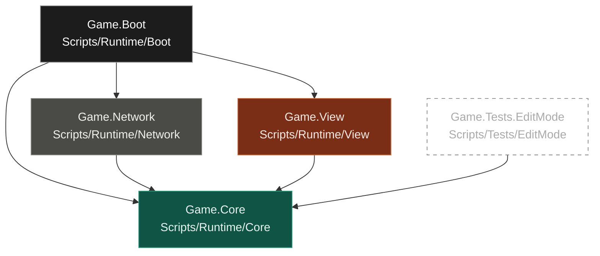

# 아키텍처

코드가 어떻게 나뉘고 서로 어떻게 말하는지, 새 코드를 어디에 두는지를 다룬다. 실행 중의 흐름은 [flows.md](flows.md)를 본다.

> 색: 초록은 로직, 주황은 뷰, 회색은 서버·네트워크.

## 로직과 뷰는 이렇게 말한다

로직은 뷰를 모른다. 그래서 화면을 통째로 갈아끼워도 로직은 한 줄도 안 바뀐다.

| 누가 → 누구에게 | 방법 | 예 |
| --- | --- | --- |
| 로직 → 뷰 (가끔 바뀌는 값) | 메시지 발행 → 구독 | 경험치가 바뀜 → 경험치 바 갱신 |
| 로직 → 뷰 (매 프레임 바뀌는 값) | 뷰가 `Update`에서 직접 읽기 | 스킬 쿨타임 표시 |
| 뷰 → 로직 | 메서드 직접 호출 | 일시정지 버튼 → `Pause()` |
| 로직 → 다른 시스템 로직 | 사건은 메시지, 현재 값은 주입받아 읽기 | 적 사망 → 경험치, 살아 있는 적 목록 조회 |

뷰는 메시지를 발행하지 않는다. 뷰가 무언가를 알리고 싶다면 그건 "해줘"이므로 ③ 호출이다.

## 계층 구조

코드는 네 계층으로 나뉘고, 계층마다 어셈블리를 둬서 의존 방향을 컴파일러가 막게 한다. 참조 설정은 1단계에 E가 한 번에 해두고, 이후 팀원은 asmdef를 수정하지 않는다.

화살표는 "참조한다"는 뜻이다. 실행 중에 데이터가 어디로 가는지는 [flows.md](flows.md)의 전체 흐름을 본다. Core는 아무도 참조하지 않고, Network와 View 사이에는 선이 없어 서로를 모른다.

컴파일 에러로 "타입을 찾을 수 없음"이 나면 대부분 방향을 거꾸로 부르고 있다는 뜻이다. Core가 View나 Network를 부르거나, View가 Network를 부르는 경우다.

### 새 코드는 어디에

필요한 것만 컴파일되는 **가장 안쪽 계층**에 넣는다.

| 새 코드가 필요로 하는 것 | 위치 |
| --- | --- |
| 게임 규칙, 계산, 상태 | Core |
| 서버 통신, JSON, 저장 | Network |
| 화면, 입력, 연출 | View |
| 여러 계층 연결 (스코프, 씬 전환) | Boot |
| 씬 전환 인터페이스 (`ISceneNavigator`, `ITransitionCurtain`, `StageContext`) | Core (`Core/Navigation`) |

- Core가 바깥 기능을 써야 하면 인터페이스는 Core, 구현은 바깥에 둔다 (`IBattleApi`처럼). 씬 전환도 같은 규칙이라 인터페이스는 `Core/Navigation`, 구현(`SceneLoader`, Root 스코프 등록)은 Boot다
- 새 기능은 새 어셈블리가 아니라 기존 계층 안의 폴더로 만든다
- 새 어셈블리는 에디터 전용 코드, 외부 SDK, 개발용 툴처럼 성격이 다른 코드가 생길 때만 E가 만든다

### 백엔드 전환

Network 안에서 `Local`과 `Http` 두 구현을 그룹 단위로 스위치한다. 규칙은 [conventions.md](conventions.md)를 본다. 어셈블리는 네 개 그대로고, Network 아래 `Local`·`Http`·`Dto` 폴더만 늘어난다.
