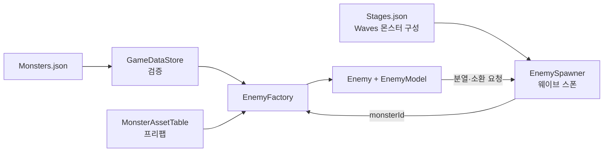

# Enemy

몬스터(적)의 구조, 데이터, 추가 절차를 정리한다. 2026-10-07 기준이다. 코드가 원본이고, 왜 이렇게 나눴는지는 [enemy-design.md](enemy-design.md), 서버와 맞춰야 하는 데이터 규칙은 [monsters-contract.md](monsters-contract.md)를 본다. 이 문서 하나로 몬스터를 추가할 수 있게 쓴다.

## 한눈에 보기

| 클래스 | 위치 | 하는 일 |
|---|---|---|
| `Enemy` (MonoBehaviour) | `Core/Enemy` | 적 한 마리의 몸. 위치(Transform), 이동 적용, 연출, 스킬이 겨누는 대상(`IEnemyTarget`) |
| `EnemyModel` | `Core/Enemy` | 규칙: 체력, 속도, 공격, 피해 계산, 패시브. 위치를 모른다 |
| `EnemyStatus` | `Core/Enemy` | 상태이상(빙결·마비·기절·감속·취약·점화·동상), 동적 면역, 이속 배율 |
| `DamageProfile` | `Core/Enemy` | 속성·시전 형태 약점/저항, 투사체 차단 (`Monsters.json`에서 만든 불변 표) |
| `IPassive` 구현들 | `Core/Enemy` | 패시브. 아래 [패시브](#passives) |
| `EnemyFactory` | `Core/Wave` | `MonsterId`로 적을 만든다. 프리팹은 `MonsterAssetTable`에서 찾는다 |
| `EnemySpawner` | `Core/Wave` | 웨이브 스폰, 매 프레임 전투 진행, 분열·소환 요청 처리 |
| `MonsterAssetTable` | `Data/*.asset` | 클라이언트 전용. `MonsterId` → 프리팹과 투사체 프리팹 |
| `MonsterDisplayTable` | `Data/*.asset` | 클라이언트 전용. `MonsterId` → 이름, 아이콘 |

위치의 단일 출처는 `Enemy`(Transform)다. 스킬 코드는 `IEnemyTarget`만 알고 `EnemyModel`을 직접 다루지 않는다.

## 데이터가 흐르는 길



- 웨이브 스폰은 `Stages.json`의 `Waves[].Spawns`(`{MonsterId, Count}`)에 적힌 몬스터를 그대로 낸다. 분열·소환으로만 나오는 몬스터는 웨이브 구성에 넣지 않는다.
- 웨이브를 끝내는 처치 수(`EnemyCount`)는 `Count`의 합계다. 첫 묶음은 구성 전체를 섞어 내고, 처치가 늦어 다음 묶음이 나올 때는 **일반 몬스터만** 반복한다. 엘리트·보스는 웨이브당 한 번만 나오고 `Count`는 1이다(어기면 부팅 예외).
- 스테이지의 "등장 몬스터"(`StageDefinition.MonsterIds`, 일시정지 창의 "등장 요마")는 데이터에 따로 적지 않고 웨이브 구성에서 첫 등장 순서로 모은다.
- 등급(보스·엘리트·일반)과 공격 방식(근접·원거리)은 `Monsters` 행에서 정해진다. 프리팹 쪽에 따로 적지 않는다.
- 소환된 적의 사망은 웨이브 게이지에 세지 않는다(`EnemyDied.IsSummoned`, [messages.md](messages.md)).

## 새 몬스터 추가 절차

1. **아트 확인**: `Prefabs/Monsters/<이름>_Animated.prefab`(리그)과 `Animations/<이름>.controller`, `<이름>_Move/Attack/Die.anim`이 있어야 한다. **컨트롤러에 상태가 실제로 채워져 있는지 연다.** 파일만 있고 레이어가 비어 있으면 클립이 있어도 재생되지 않는다(ArmoredCrab, BrainSpider, EyeJelly가 그랬다). `Tools/Monster/Bake Animations`가 만드는 컨트롤러는 `Idle/Move/Hit/Die` 구조(`Attack` 상태 없음, `Moving` 파라미터 있음)라서 지금 몬스터들이 쓰는 구조와 다르다. 새 몬스터는 `Ghost.controller`와 같은 구조로 직접 만든다: 파라미터 `Attack`·`Die`(트리거), `Move`(기본, 반복) → `Attack` 트리거로 `Attack` → 끝나면 `Move`, 어느 상태에서든 `Die` 트리거로 `Die`.
2. **웨이브 프리팹**: `Prefabs/Stage/Skeleton.prefab`을 복사해 `Prefabs/Stage/<이름>.prefab`을 만든다. `Scripts/Editor/WaveMonsterVisualLinker.cs`의 `Links`에 `("<이름>", "<이름>_Animated", false)`를 더하고 메뉴 `Tools/Monster/Link Visuals To Wave Prefabs`를 실행하면 리그가 `Visual` 자식으로 붙는다(엘리트는 세 번째 값을 `true`로, 1.2배 크기에 원래 색).
3. **`Monsters.json` 행**: [필드](#monsters-json-필드)와 [패시브](#passives)를 보고 새 `Id`로 행을 더한다. 지금은 일반 1~6과 21 이후, 엘리트 11~12, 보스 100을 쓰고 있다.
4. **`MonsterAssetTable.asset`**(`Data/`): 인스펙터의 표에 `Key`(= `MonsterId`)와 `prefab`(웨이브 프리팹의 `Enemy`)을 더한다. 원거리(`ProjectileSpeed > 0`)면 `projectilePrefab`도 연결한다(예: `Slime_Projectile`).
5. **스테이지 배치**: 웨이브에 나오게 하려면 `Stages.json`의 해당 스테이지 `Waves[].Spawns`에 `{MonsterId, Count}`를 더한다. 소환·분열로만 나오는 몬스터는 넣지 않는다.
6. **이름·아이콘**(선택): `MonsterDisplayTable.asset`에 항목을 더한다. 없으면 일시정지 창에는 `#Id`로 보인다.
7. **검증**: 표 항목·몬스터 프리팹·원거리 투사체 연결은 샌드박스에서 직접 확인한다. 능력은 `NewMonsterDataTests`처럼 실제 데이터를 사용해 공격·방어·상태이상 동작을 검증한다. 마지막에 EditMode 전체를 돌린다.

자주 하는 실수:
- 소환 대상(`Spawn`의 `MonsterId`)은 존재해야 하고 자기 자신이거나 다시 `Spawn` 패시브를 가지면 안 된다(연쇄 소환 금지). 부팅 때 예외가 난다.
- 확률 값(`Chance`)이 1보다 작은 패시브는 `EnemyFactory`가 주는 랜덤이 필요하다. 테스트에서 `PassiveBuilder.BuildPassives`를 직접 부르면 랜덤을 넘겨야 한다.
- 값을 바꾼 `Monsters.json`은 플레이 모드를 다시 켜야 반영된다(부팅 때 읽는다).

## Monsters.json 필드

| 필드 | 타입 | 기본/필수 | 설명 |
|---|---|---|---|
| `Id` | int | 필수, 유일 | 몬스터 행 ID. `Stages.Waves[].Spawns[].MonsterId`, `Spawn.MonsterId`, `MonsterAssetTable` 키가 가리킨다 |
| `Hp` | int | 필수, 1 이상 | 최대 체력 |
| `Damage` | int | 0 이상 | 공격 한 번의 피해(벽에) |
| `Speed` | float | 0 이상 | 이동 속도(월드 단위/초). 느림 0.05~0.08, 보통 0.1, 빠름 0.14, 매우 빠름 0.18 정도로 쓴다 |
| `AttackInterval` | float | 필수, 0 초과 | 공격 간격(초) |
| `AttackRange` | float | 0 이상 | 원거리가 공격하는 거리. 근접은 0 |
| `ProjectileSpeed` | float | 0 이상 | 0보다 크면 **원거리**, 0이면 근접 |
| `IsBoss` | bool | false | 보스 등급 |
| `IsElite` | bool | false | 엘리트 등급(`IsBoss`와 함께 켤 수 없다) |
| `BurstCount` | int | 1 | 공격 한 번에 연달아 나가는 횟수. 1이면 연속 공격이 아니다 |
| `BurstInterval` | float | 0 | 연속 공격의 타격 간격(초). `BurstCount`가 2 이상일 때 필요하고 `AttackInterval > BurstInterval * (BurstCount - 1)`이어야 한다 |
| `Resists` | {속성 이름: 비율} | 비어 있음 | 속성별 약점(+)/저항(-), -1은 무효. 키는 `Neutral`, `Fire`, `Ice`, `Wind`, `Lightning`, `Earth`(대소문자 구분) |
| `CastResists` | {시전 형태: 비율} | 비어 있음 | 시전 형태별 가감. 키는 `Projectile`, `Hitscan`, `Area`, `Beam`, `Chain`(대소문자 구분) |
| `BlocksProjectile` | bool | false | 투사체의 직접 충격 피해를 무효로 하고 관통을 막는다. 부가 반응(폭발·상태이상)은 그대로 걸린다 |
| `Passives` | 목록 | 비어 있음 | [패시브](#passives) |
| `Exp`, `GaugeValue` | int | 0 | **지금 코드는 읽지 않는다.** 보상은 `StageRewards`가 정한다. 시트와 계약에서 뺄 후보다 |

속성 약점/저항은 곱해지고, 줄어도 무효(-1)가 아니면 최소 피해 1이 들어간다. 지상 공격 면역은 `"Earth": -1`, 투사체 감쇠는 `"CastResists": {"Projectile": -0.7}`로 쓴다. 자세한 계산은 [enemy-design.md](enemy-design.md)의 피해 파이프라인을 본다.

## Passives

`Passives`는 `Kind`와 그 종류가 쓰는 값의 목록이다. 안 쓰는 값은 비워 둔다. `Kind`는 대소문자를 구분해서 정확히 쓴다.

| Kind | 값 | 동작 |
|---|---|---|
| `Spawn` | `Trigger`(`OnDeath` / `Interval`), `MonsterId`, `Count`, (`Interval`, `MaxTotal`) | 지정한 몬스터를 `Count`마리 만들어 달라고 요청한다. `OnDeath`는 죽을 때 한 번(분열), `Interval`은 주기마다 총 `MaxTotal`마리까지(소환) |
| `Immunity` | `Statuses` | 걸리지 않는 상태이상. 이름은 `Stun`, `Burn`, `Paralysis`, `Freeze`, `Slow`, `Frostbite`, `Vulnerability`, `AllDebuffs` |
| `Modifier` | `Target`(`KnockbackDistance` / `BurnDuration`), `Multiplier` | 받는 효과의 크기에 곱하는 배수. 0.5면 절반, 0이면 무효, 4면 4배. 같은 대상이 여럿이면 곱한다 |
| `Shield` | `Trigger`(`Start` / `OnHit`), `Hits`, `Duration`, `Chance`, `Statuses` | 스킬 공격을 `Hits`번 막는다. 켜져 있는 동안 스킬 피해는 부가 피해까지 막고 적중만 횟수에 센다. `Duration` 0이면 횟수를 다 막을 때까지. `Statuses`는 켜져 있는 동안만 걸리지 않는 상태이상. 1회성 |
| `Evade` | `Chance` | 적중을 확률로 피한다. 피하면 같은 공격의 부가 피해와 상태이상도 0.1초간 막는다 |
| `LowHp` | `HpRatio`, `Duration`, `HealRatio`, `Invulnerable`, `SpeedMultiplier`, `Statuses` | 체력 비율이 `HpRatio` 이하가 되면 한 번, `Duration` 동안 회복·무적·가속·면역. 효과가 하나도 없으면 거부 |
| `HealOnHit` | `HealRatio`, `SpeedMultiplier`, `Duration`, `Chance`, `Element` | 적중에 맞을 때 확률로 회복과 가속. `Element`를 정하면 그 속성에만 반응 |
| `SpeedBoost` | `Interval`, `Duration`, `SpeedMultiplier` | `Interval`마다 `Duration` 동안 이속 배수 |

- 값의 범위와 검증 메시지는 `PassiveDefinition.Validate`가 정한다. 잘못된 값은 부팅 때 `Monsters <Id>: ...` 예외로 거부한다.
- "적중"은 직접 피해(`DamageInfo.IsImpact`) 하나다. 폭발·장판·추가 번개 같은 부가 피해는 방어막 횟수, 회피 판정, 피격 회복에 세지 않는다.
- 기절·빙결·마비 중에는 패시브의 시간이 흐르지 않는다(`Shield`의 `Duration`, `LowHp`, `SpeedBoost`, `Spawn`의 `Interval`).

예시(`Monsters.json`의 실제 행에서):

```json
{"Id": 1, ..., "Passives": [{"Kind": "Spawn", "Trigger": "OnDeath", "MonsterId": 3, "Count": 2}]}
{"Id": 5, ..., "Passives": [{"Kind": "Spawn", "Trigger": "Interval", "MonsterId": 6, "Count": 2, "Interval": 6.0, "MaxTotal": 4}]}
{"Id": 21, ..., "Resists": {"Lightning": -1}, "Passives": [
    {"Kind": "Shield", "Trigger": "Start", "Hits": 6, "Statuses": ["AllDebuffs"]},
    {"Kind": "Immunity", "Statuses": ["Burn"]},
    {"Kind": "Modifier", "Target": "KnockbackDistance", "Multiplier": 0.5}]}
```

## 현재 몬스터

체력 999인 몬스터(1, 2, 12, 100)는 개발 중 테스트용 값이다. 이름과 아이콘은 아직 없다(`MonsterDisplayTable`에는 1, 2, 11, 12, 100이 임시 이름이다).

| Id | 리그 | 등급·공격 | 능력 |
|---|---|---|---|
| 1 | Slime | 일반, 원거리 | 죽으면 3번을 2마리 분열 |
| 2 | Bat | 일반, 근접 | - |
| 3 | Slime(Mini) | 일반, 근접, 분열 전용 | - |
| 4 | Horned (오니) | 일반, 근접 | 기절 면역, 밀치기 절반 |
| 5 | Spider (츠치구모) | 일반, 근접 | 6초마다 6번을 2마리 소환(최대 4마리) |
| 6 | Spider(Mini) | 일반, 근접, 소환 전용 | - |
| 11 | Slime(엘리트) | 엘리트, 원거리 | - |
| 12 | Bat(엘리트) | 엘리트, 근접 | - |
| 21 | ArmoredCrab | 일반, 근접 | 시작 방어막 6번(켜진 동안 모든 디버프 면역), 점화·뇌속성 면역, 밀치기 절반 |
| 22 | BrainSpider | 일반, 근접 | 빠름, 4초마다 1.5초간 2.5배 돌진, 빙속성 +50% |
| 23 | EyeJelly | 일반, 근접 | 맞으면 40% 확률로 4초 방어막 3번(1회), 30% 회피, 토속성 +100% |
| 24 | Ghost | 일반, 근접 | 토속성 면역, 가장 빠름 |
| 25 | Golem | 일반, 근접 | 투사체 직접 피해 무효와 관통 차단, 점화·마비·빙결 면역, 화속성 +200%, 밀치기 절반 |
| 100 | Skeleton | 보스, 근접 | - |

## 검증과 테스트

- 부팅(`GameDataStore`)이 `Monsters`의 값 범위, 패시브 정의, 소환 참조(없는 `Id`, 자기 자신, 연쇄 소환), 스테이지 웨이브 구성의 몬스터 존재와 엘리트·보스 `Count` 1을 검사하고 어기면 예외로 멈춘다.
- 테스트: 패시브 단위(`DefensivePassiveTests`, `PassiveTests`, `StatusModifierTests`, `EnemyBurstAttackTests`), 피해 계산(`DamageProfileTests`, `DamageContractTests`, `DamageHookTests`), 몬스터별 능력(`NewMonsterDataTests`), 로스터(`EnemyRosterTests`).

## 알려진 한계

- 방어막이 켜져 있는 동안 밀치기 저항이 오르는 효과는 없다. `Modifier`는 몬스터가 만들어질 때 고정된다.
- `PassiveDefinition`이 모든 `Kind`의 값을 한 클래스에 담는다(JSON 모양은 그대로 두고 Kind별로 나눌 후보).
- 이름·아이콘(`MonsterDisplayTable`)은 몬스터 3~6, 21~25에 없다.
