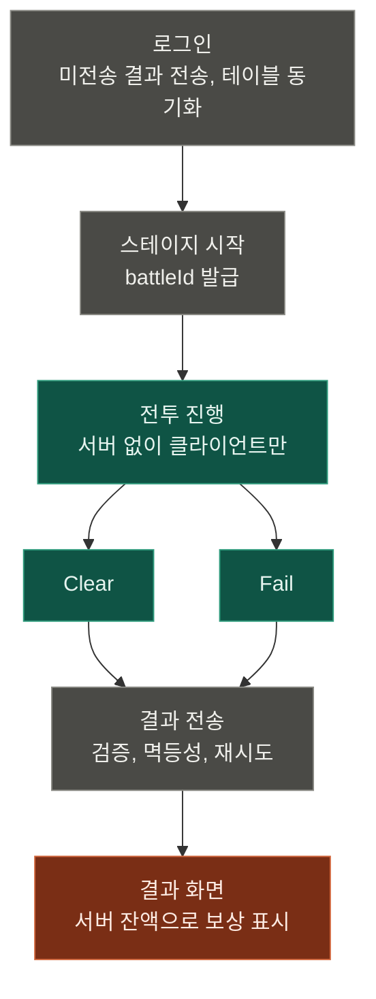
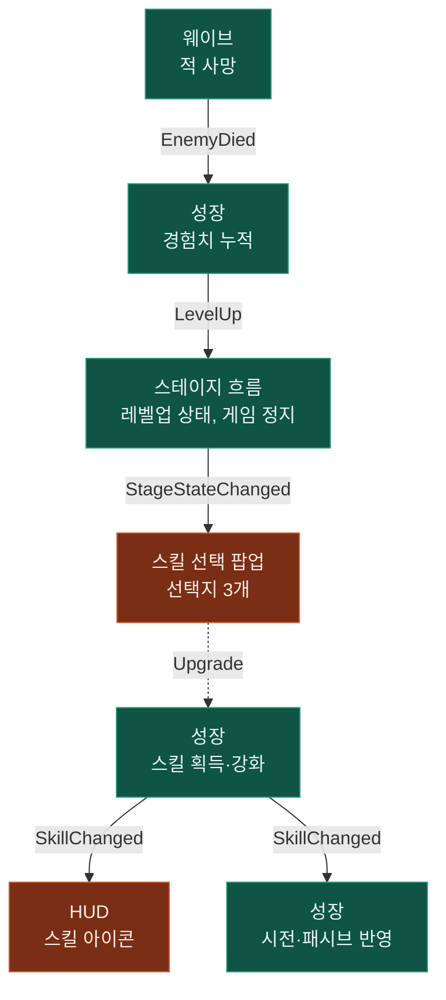
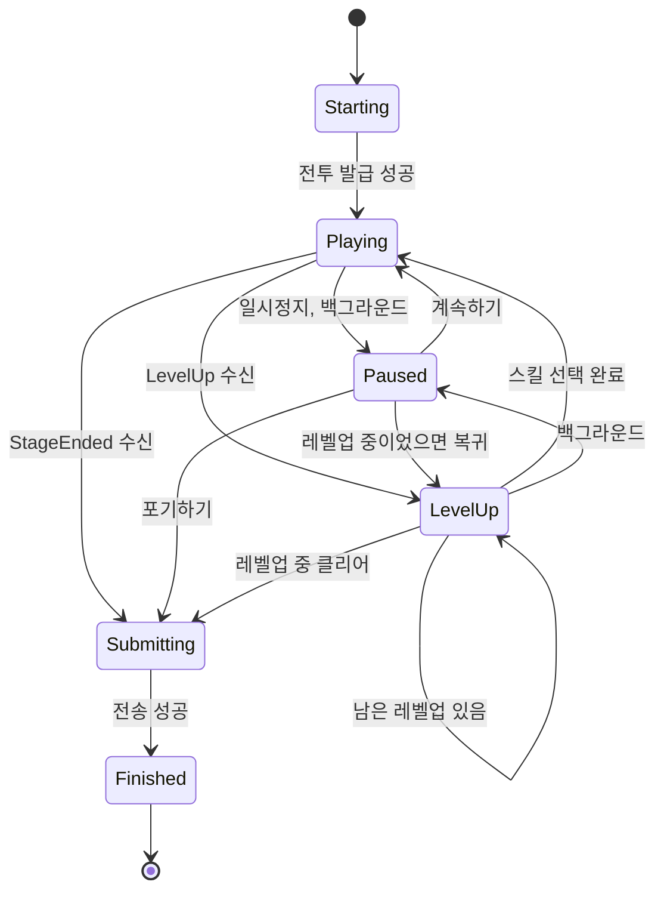

# 주요 흐름

실행 중에 무엇이 어떤 순서로 일어나는지를 다룬다.

> 그림 읽는 법: 초록은 로직, 주황은 뷰, 회색은 서버 통신. 실선은 메시지, 점선은 직접 호출.

## 스테이지 생명주기와 서버 통신 구간

회색 세 곳만 서버와 통신한다.

### 실패와 복구

| 어디서 | 무슨 일이 | 그다음 |
| --- | --- | --- |
| 스테이지 시작 | `DATA_OUTDATED` | 테이블 재동기화 후 다시 발급 |
| 스테이지 시작 | 그 밖의 실패 | 재시도 또는 Lobby |
| 전투 진행 | 일시정지에서 포기하기 | 판정 없이 결과 전송으로 |
| 결과 전송 | 네트워크·서버 오류 | 자동 재시도 3회 → 수동 재시도 버튼 |
| 결과 전송 | 거절 (만료, 검증 실패 등) | 거절 안내 후 Lobby |
| 결과 전송 중 | 앱 강제 종료 | 다음 로그인 때 "미전송 결과 전송"에서 보냄 |

### 꼭 지킬 것

- Clear·Fail은 상태가 아니라 결과값이다. 실패해도 새 상태를 만들지 않고 같은 상태에 머문 채 실패 메시지만 방송한다
- 미전송 결과는 새 전투 발급보다 **반드시 먼저** 보낸다. 새 발급이 진행 중 전투를 포기 처리하기 때문이다
- 재시도 요청은 처음 만든 스냅샷을 그대로 쓴다. 매번 새로 만들면 `playTime`이 달라져 다른 요청이 된다
- 골드는 `+=`가 아니라 서버 잔액으로 덮어쓴다. 재전송 때 두 번 표시되는 것을 막는다

## 스킬 선택

선택이 끝나면 팝업이 스테이지 흐름에 알린다(호출). 남은 레벨업이 있으면 새 선택지가 다시 뜨고, 없으면 전투로 돌아간다.

- 일시정지 후 레벨업으로 돌아올 때는 선택지를 새로 뽑지 않는다. 일시정지로 리롤하는 꼼수를 막기 위해서다

## 스테이지 상태 머신

여기 없는 전환은 무시된다.

