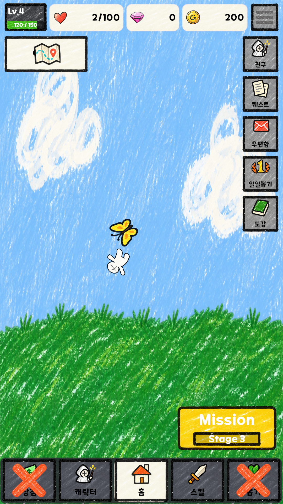
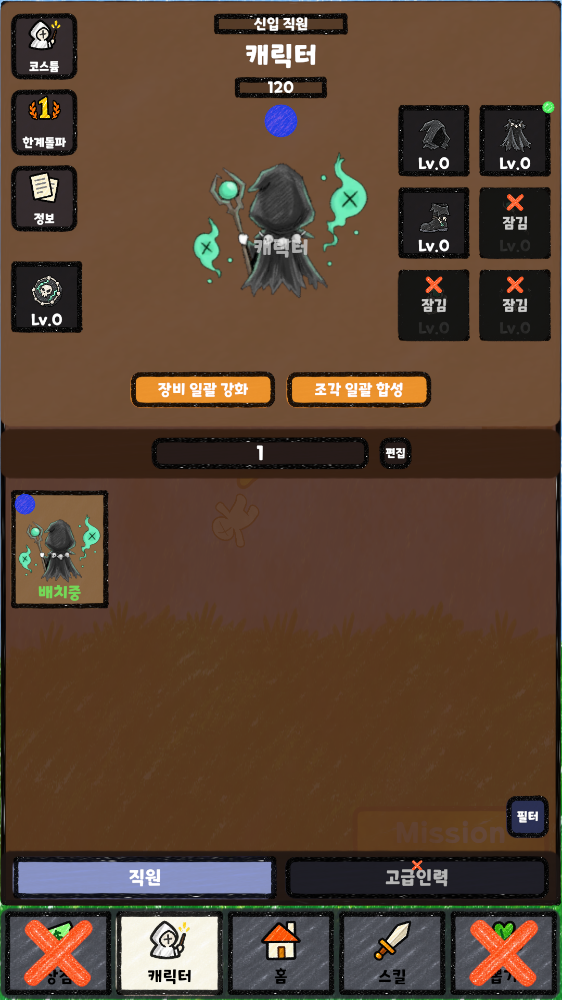
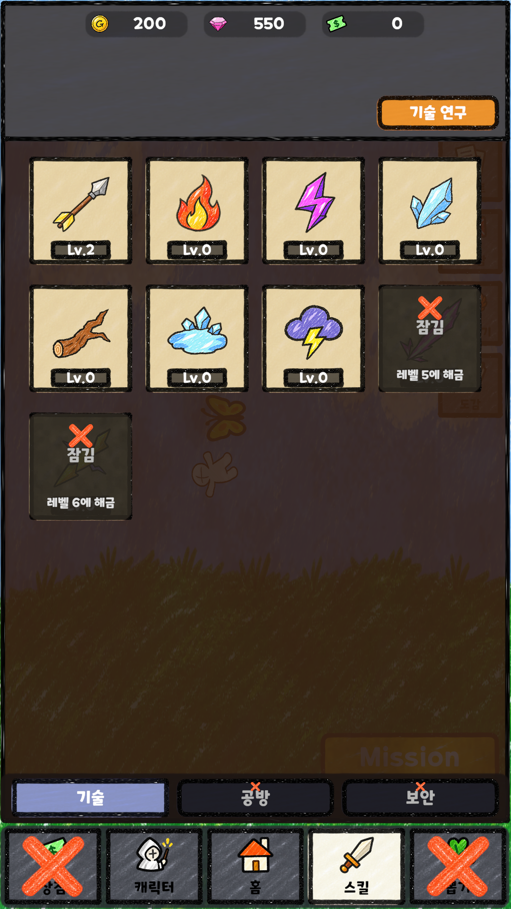
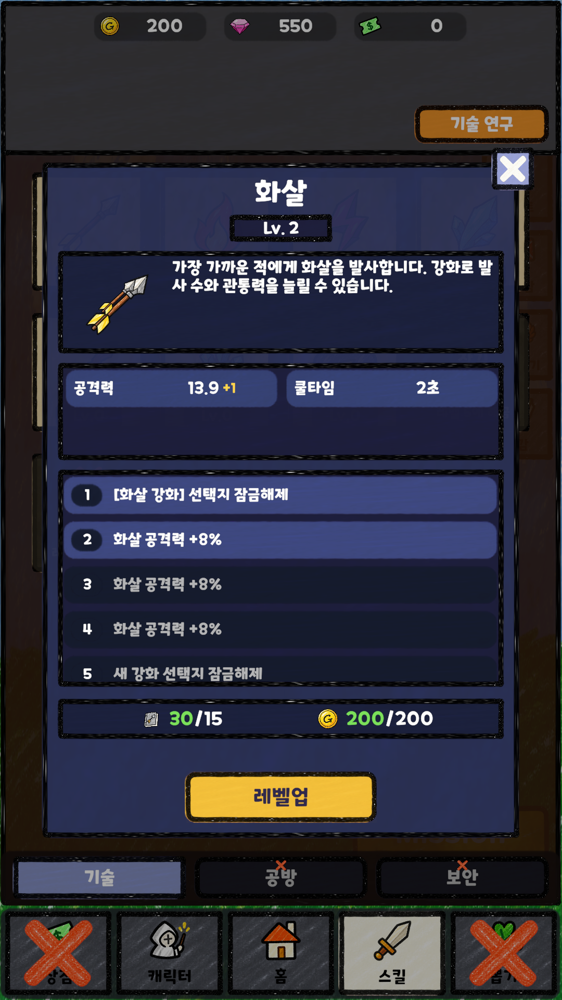
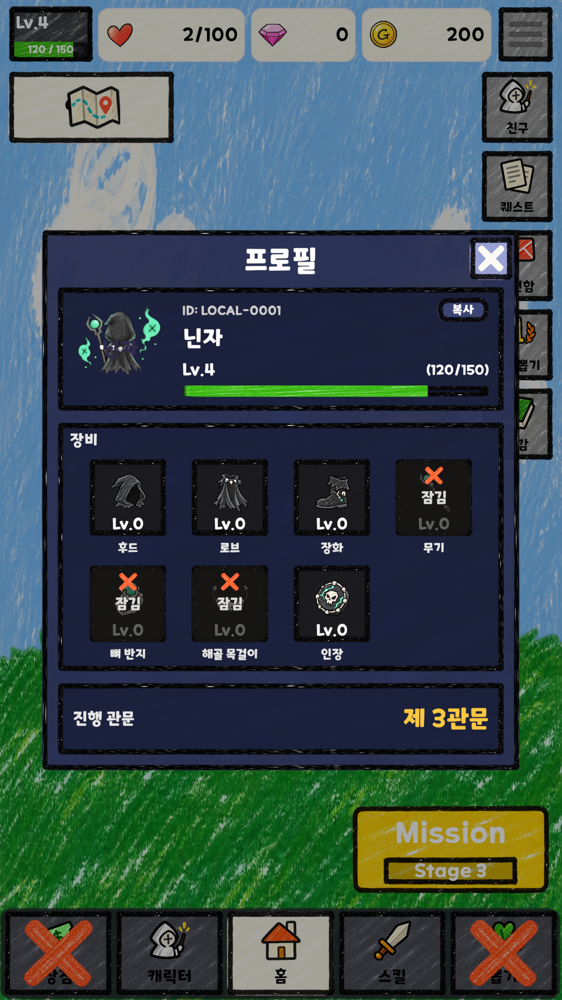
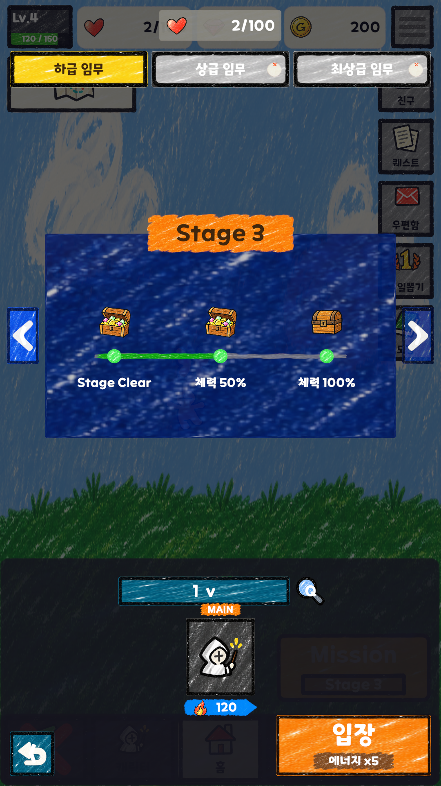
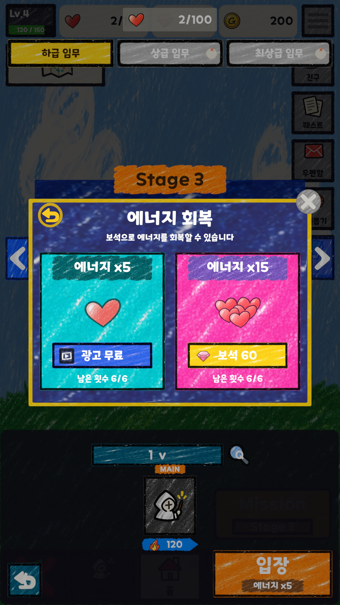

# 로비 에셋 적용 (#277)

저장된 Lobby 씬의 이전 시트 override와 기본 도형 슬롯을 기존 Generated 에셋으로 연결했다. UI 프리팹 18개를 Unity에서 저장하고 씬에도 적용했다. 추가 제작이 필요한 에셋은 없다.

| 영역 | 적용한 기존 에셋 |
| --- | --- |
| 홈, 상단 재화, 하단 탭, 사이드 메뉴 | UIFrames, UIFills, UIMenuGlyphs, UIControlGlyphs, Coin/Gem/Heart |
| 캐릭터 목록과 프로필 | Player, Equipment 7종, 프레임, 경험치 GreenFill |
| 스킬 목록과 강화 팝업 | SkillAssetTable의 HUD 아이콘 9종, ItemIconTable의 강화 재료 |
| 미션과 기력 회복 | 기존 Chest, Heart/HeartBundle, 버튼 프레임과 glyph |

스킬 이미지는 카탈로그의 AssetKey로 선택한다. 재료 이미지는 MaterialItemId가 가리키는 아이템의 IconKey로 선택하며, 데이터가 없는 경우 이전 이미지가 남지 않도록 비운다. 선택·잠금 상태와 버튼 이벤트를 유지했다. 새 장식 Image는 raycastTarget을 끄고 LayoutElement.ignoreLayout을 켰다.

UIMenuGlyphs의 잘린 아이콘과 인접 문양이 포함된 슬라이스는 Sprite Editor 데이터 공급자로 경계를 수정했다. 원본 PNG, GUID와 spriteID는 유지했다. 슬라이스 계획과 웹 미리보기도 갱신했다.

## 확인 방법

1. Boot 씬을 재생해서 Lobby에 진입한다.
2. 캐릭터 → 스킬 → 홈 탭을 전환하고 선택/잠금 표시를 확인한다.
3. 스킬 목록을 눌러 강화 팝업의 스킬과 비용 재료 아이콘을 확인하고 닫는다.
4. 프로필을 열어 캐릭터, 장비 7종, 경험치 게이지를 확인하고 닫는다.
5. 미션을 열어 관문과 보상 상자를 확인한다. 기력이 부족하면 입장을 눌러 기력 회복 팝업을 확인한다.

## 검증

- 저장한 프리팹을 직접 로드하는 회귀 테스트 3개: 스킬 목록/잠금, 팝업 스킬·재료, 누락 시 이전 아이콘 제거.
- 전체 Edit Mode 테스트 통과. 최종 실행 수와 결과는 [test-results.json](asset-previews/lobby/test-results.json).
- EventSystem.RaycastAll로 대상 Button이 첫 입력 대상인지 검사한 후 pointerClick을 보냈다. 탭 전환, 스킬/프로필 팝업 열기·닫기, 미션 진입 및 로컬 광고 기력 회복 → Stage 진입을 확인했다.
- 로비 Image 581개를 검사했다. 이전 Sheet.png 참조 0개. 기본 이미지는 투명 마스크, modal dimmer, 구분선에만 남겼다.
- Play Mode의 로비/Stage 실행에서 Unity Console 오류 0개. 캡처는 Game View를 1080×1920으로 렌더링한 결과이며 물리 모바일 기기 검증은 포함하지 않는다.

## 화면

| 홈 | 캐릭터 | 스킬 |
| --- | --- | --- |
|  |  |  |

| 스킬 강화 | 프로필 | 미션 | 기력 회복 |
| --- | --- | --- | --- |
|  |  |  |  |
