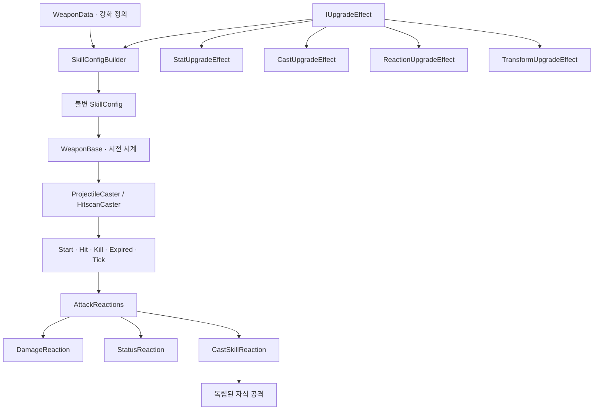

# 스킬 시스템

스킬의 요구사항, 현재 구조, 실행 규칙, 구현 상태, 리팩 계획을 한 문서에 모았다. 2026-10-05 기준이다.

- 실행 데이터의 원본은 `Assets/_Project/Resources/MockData/Weapons.json`이다.
- 같은 폴더의 `requirements.json`은 요구사항 추적용이며 런타임에서 읽지 않는다. 검증은 저장소 루트에서 `python3 docs/ninjutsu/validate_requirements.py`로 한다.
- 원문은 `ninjutsu-source-initial.txt`, `ninjutsu-source-additional.txt`다. 15종·168개 카드를 줄 번호로 연결했다.

### 원문 용어 대응

원문 txt와 `requirements.json`의 줄 번호는 원문의 일본풍 용어를 기준으로 한다. 이 문서는 아래 용어로 바꿔 쓴다. 원문 txt는 원본 보존을 위해 수정하지 않는다.

| 원문 | 이 문서 | 원문 | 이 문서 |
|---|---|---|---|
| 인술 | 스킬 | 비둔술 | 무속성 |
| 쿠나이 | 화살 | 화둔술 | 화속성 |
| 요마 | 마물 | 수둔술 | 빙속성 |
| 비기 | 필살기 | 풍둔술 | 풍속성 |
| 비기 · 아마테라스 | 필살기 · 태양의 심판 | 뇌둔술 | 뇌속성 |
| 비기 · 츠쿠요미 | 필살기 · 달의 심판 | 토둔술 | 토속성 |
| 염폭술 | 폭염 각성 | 비둔술 증폭 · 甲/乙/丙 | 무속성 증폭 · Ⅰ/Ⅱ/Ⅲ |
| 여우불 | 도깨비불 | 월광쿠나이 | 월광 화살 |

문서용 카드 ID(`kunai.01` 등)와 실행 ID(`kunai_spread` 등)는 그대로다. 캐릭터 이름(히노 마도카, 쿠로네코 아카네, 나나기 히스이)도 아직 바꾸지 않았다.

목차: [1. 확정·보류 결정](#1-확정보류-결정) · [2. 현재 구조](#2-현재-구조) · [3. 현재 실행 규칙](#3-현재-실행-규칙) · [4. 구현 상태](#4-구현-상태) · [5. 검증](#5-검증) · [6. 리팩 계획](#6-리팩-계획) · [부록 A. 제공 각주](#부록-a-제공-각주) · [부록 B. 카드별 대응표](#부록-b-카드별-대응표)

## 1. 확정·보류 결정

### 확정

- 해금 조건의 스킬 레벨은 로비 영구 스킬 레벨이다.
- 최대 등장 횟수는 선택 성공 때만 쓴다. 미선택 제시와 적용 실패는 차감하지 않는다.
- 최대 레벨은 최초 습득을 제외한 전투 강화 횟수 상한이다. 화살은 습득 후 최대 15회 강화한다. 표시 레벨이 1부터 시작해도 표시값과 강화 횟수는 분리한다.
- 일반과 (+)는 같은 카드이며 최대 등장 횟수를 공유한다. 전환은 카드별 영구 5·9·17레벨이다(부록 A). 각주가 없는 디버프는 자동 제거하지 않는다.
- 두 스킬의 증폭·연마 선택은 양쪽 스킬의 습득 수를 함께 올린다.
- 화살 난사와 확산은 합쳐 보조 화살 총 6개다. 히스이 필살기는 예외로 태풍 레벨을 참조한다.
- 단방향 제한을 보존한다. 얼음창 연발→일제 사격→관통, 벼락 심판의 천둥→자기 폭풍은 허용 순서다. 제외 조건을 양방향으로 바꾸지 않는다.
- 기본 상태이상 확률은 100%이고, 자료의 별도 확률이 우선한다(충격 통나무 기절 10%). 점화는 본체 직접 명중에만 적용하고 폭발에 전파하지 않는다.
- 저장 데이터 호환은 고려하지 않는다. 아직 출시 전이라 효과 종류 키, JSON 스키마, 카드 ID를 바꿔도 된다. 다만 `Weapons.json`, 테스트, `requirements.json`, `validate_requirements.py`는 함께 갱신해야 한다.

### 보류

- 두 자료의 선행조건·피해 감소·등장 횟수 차이: 화염구 수련/폭염 각성, 얼음창 일제 사격, 벼락 피해 증폭, 통나무 피해 증폭과 형태 조건. 현재는 보수적 조건을 택했고 카드별 사유는 부록 B에 있다.
- 백분율 효과의 합연산/곱연산 최종 정책, 기본 수치, 반복 간격, 영구 성장 ID와 비용.
- 캐릭터 기본 강화의 횟수 사용, 계열 증폭의 실제 양쪽 상태 갱신과 실행 연결.
- 삼각 얼음창 일반 분열의 개수·피해(임시 3개·부모 50%), 업화·번지는 화염의 세부 규칙.
- 광선 공격 횟수의 의미, 월광 증폭 명칭, 모래 폭탄/모래 폭발 동일 여부, 캐릭터 이름 불일치.
- `hold` 행은 사유를 해결하기 전에 활성 데이터로 자동 변환하지 않는다. 실행 활성 행 중에도 검토가 필요한 보류 항목이 있다.

범위 메모: 최초 분류 자료에 도깨비불이 있지만 추가 15종 목록에는 없다. 효과 자료가 없어 대응표에 넣지 않았다. 원문의 전력망 충전 반복 표기와 필살기 설명의 반복 문장은 중복 카드로 만들지 않았다. 삼각 얼음창은 삼각→일반→소형 분열 순서를 보존한다.

## 2. 현재 구조



- `SkillConfig`는 공격 종류·경로·사거리, 효과별 스탯, 추가 이벤트 반응을 보존한다. 강화는 현재 설정의 복사본에 순서대로 적용하고 전부 성공하면 한 번에 교체한다. 공유 강화도 모든 참여 스킬의 준비가 성공한 뒤 함께 반영한다. 이미 발사한 공격은 이후 강화로 변하지 않는다.
- 실행 스탯은 `Cast`, `Projectile`, `Status`, `Burn`, `Explosion`, `Secondary`, `Field`의 불변 값이다. 타깃 선택, 전투 강화 횟수, 후보 생성, 카탈로그 검증은 각각 독립 클래스다.
- JSON의 `EffectDef{kind,value}`는 `WeaponStatEffects.TryCompile`이 `IUpgradeEffect`로 변환한다. JSON DTO(`EffectDef`)와 실행 객체(`StatUpgradeEffect`)는 역할이 다르다. 효과 종류는 `EffectRegistry`가 키(`"damage"` 등), 분류, 소비하는 공격, 값 규칙, 적용 방식을 한 줄로 선언한다.

| 실행 효과 | 책임 |
|---|---|
| `StatUpgradeEffect` | 공격력·속도·범위 등 기존 수치 계산 |
| `CastUpgradeEffect` | 발사 수·시전 수·예비 시전 수 변경 |
| `ReactionUpgradeEffect` | 이벤트에 피해·상태·자식 시전 추가 |
| `TransformUpgradeEffect` | 구현된 5개 형태로 전환 |

상태이상·분열 등 숫자 효과는 내부 어댑터 `NumericReactionUpgradeEffect`가 변환하고, 실제 투사체를 만들 때 반응으로 컴파일한다. JSON에 C# 타입이나 델리게이트를 직렬화하지 않는다.

### 공격 이벤트

`AttackEvent`는 `Start`, `Hit`, `Kill`, `Expired`, `Tick`, `Bounce`다. 투사체와 Hitscan은 `Bounce`를 제외하고 발생시킨다. `Bounce`는 Chain 공격이 발생시켜야 한다.

- `Tick`에는 공격별 경과 시간과 deltaTime을 전달한다. `PeriodicReaction`이 이 값으로 주기를 계산하므로 같은 설정을 쓰는 공격끼리 타이머를 공유하지 않는다.
- `Expired`는 투사체 수명이 끝날 때 발생한다. 관통 횟수를 소모해 회수될 때는 발생하지 않는다. Hitscan은 애니메이션·시간에 따른 Release 때 발생한다.
- 상태이상 대상의 지연 사망은 즉시 `Kill`과 다르므로 기존 점화 시스템의 사망 콜백을 유지한다.
- `CastSkillReaction`은 호출 횟수와 확률을 갖는다. 부모 반응을 자식에 자동 복사하지 않고, 각 단계의 Spawner가 전달할 수치와 다음 반응을 명시한다. 이렇게 소형 투사체의 무한 분열과 형태 역변환을 막는다.

### 미구현 스킬이 요구하는 실행 요소

| 스킬 | 대표 강화 | 필요한 실행 요소 |
|---|---|---|
| 태양 광선 | 광선 발사·광선 난사·양전자포 | `Start` 자식 시전, Beam 공격, 다중 배치, 형태 전환 |
| 달빛 광선 | 월광 굴절·초점 조정·월광 화살 | Beam 경로, 같은 대상 공격 누적, 다른 스킬 설정 참조 |
| 서리 감옥 | 얼음 결정 파열·매서운 서리 | **구현됨(첫 검증 대상)**: `Area` 공격, `Expired` 자식 시전. 미구현: 빙결 중 최대 HP 비례 피해, 중심부 추가 공격 |
| 연쇄 번개 | 이온 폭파·전류전도 | Chain 공격의 `Bounce`, 경로 피해, 대상 상태 조건 |
| 운석 | 유성비·화염 운석 | 위치별 피해, 주기 자식 시전, 지속 지대 |
| 태풍 | 집중 폭풍·이중 태풍 | `Expired` 자식 시전, 동시 배치, 끌어당김 |
| 번개 그물 | 지속 감전·전율의 그물 | `Hit` → 연쇄 번개, 자식 반사 수 조정 |
| 모래 폭발 | 도약 모래 폭발 | 명중 후 이동·재공격, 도약 횟수 제한 |
| 나선 회오리 | 난기류·폭풍 집결·진공 | `Hit` → 다른 영역 스킬, 끌어당김·밀침 정책 |
| 번개 구름 | 특이점·구름 분열·번개 유도 | **구현됨(두 번째 검증)**: 이동·끌어당기는 `Area`, `Hit` 확률 자식 시전(번개 유도). 미구현: 블랙홀, 분열 구름, 폭풍 특이점 |

## 3. 현재 실행 규칙

구현된 7종의 동작 기준이다. 서리 감옥과 번개 구름의 동작은 아래 각 항목에 있다. 원문과 충돌하거나 임시로 승인한 값은 확정 밸런스가 아니다.

### 공통

- 피해 증가는 선택 순서대로 곱한다. 직격 전용 강화는 폭발 피해를 올리지 않는다. 피해를 정수로 바꿀 때 기존 절삭 규칙을 유지한다.
- 한 시전의 투사체 수, 시간 간격을 둔 연발 수, 첫 명중 이후 관통 수를 구분한다. 연발 간격 기본값은 0.1초다.
- 시전 시점의 불변 설정을 공격에 전달한다. 발사 이후 강화는 이미 발사된 공격을 바꾸지 않는다. 풀 재사용 시 명중 기록·상태·반응을 초기화한다.
- 상태이상 확률은 별도 수치가 없으면 100%다. 명중 피해 이후 상태를 적용한다. 동일 대상 반복 명중은 막는다.
- 자식 공격은 명시한 효과만 상속한다. 자동 재분열이나 상태·처치 반응의 무한 전파를 허용하지 않는다.
- 해금은 영구 레벨, 전투 상한은 최초 습득을 제외한 성공한 강화 횟수다. 일반/(+) 카드의 선택 횟수는 공유한다. 단방향 제외 조건을 양방향으로 바꾸지 않는다.

### 화살

- 보조 화살은 확산 2개, 난사 추가 4개로 총 6개다. 피해는 본체의 50%에 보조 전용 피해 보정을 적용한다. 원본 명중 적을 제외하고 재분열하지 않는다.
- 증폭의 등장 횟수는 1회, 영구 13레벨 해금으로 적용했다. 화살 폭풍의 횟수는 보류 상태다.
- 넉백 기본 거리 0.2, 15% 강화 후 0.23이다. 넉백은 벼락 습득을 요구하고 폭발과 배타다. 천둥은 넉백·가속 선행, 속도 2배와 마비 1초를 추가한다.
- 연발 기본 페널티는 피해 -10%, 쿨타임 -20%다. (+) 피해 보정은 제공 각주의 전환 조건을 따른다.
- 피뢰침은 같은 적에게 본체 피해의 50%를 추가하는 즉시 피해다. 새 공격으로 다시 생성하지 않는다. 보조 피뢰침도 보조 피해의 50%이며 보조 폭발은 해당 카드로만 추가한다.

### 화염구·폭발·점화

- 폭발 기본 반경은 0.8, 피해는 본체 기준 100%다. 반경 경계는 포함하고 동일 대상을 중복 계산하지 않는다.
- 분열 화염구는 3개, 본체 피해의 50%, 방향 -30/0/+30도, 크기 0.5, 부모 속도, 수명 3초다. 관통·점화·폭발을 자동 상속하지 않는다.
- 폭염 각성 형태는 1.5×0.65, 관통 2, 영구 13레벨 해금이다. 폭발 강화와의 배타는 영구 25레벨 미만에서만 적용한다. 수련 선행조건은 자료 충돌로 보수적으로 적용했다.
- 점화 기본은 직격 피해의 10%/초, 6초다. 본체 직접 명중에만 걸고 폭발에는 전파하지 않는다. 중첩 대신 더 강한 피해·더 긴 시간을 유지하며 재적용으로 틱을 초기화하지 않는다.
- 최대 체력 점화는 최대 HP의 3%/틱을 더한다. 점화 중 어떤 공격으로든 사망하면 발사 시점 스냅샷으로 사망 폭발을 실행한다. 연쇄 처리 전에 콜백을 해제하고 새 점화를 전파하지 않는다.

### 얼음창

- 기본 빙결은 2초이며 긴 남은 시간을 유지한다. 얼음창의 실제 영구 성장 ID는 미연결이다.
- 소형 분열은 3개, 본체 피해의 50%, 분열 전용 강화 +80%다. 관통·빙결은 자동 상속하지 않는다.
- 동상은 10초 동안 최대 5개 독립 중첩이다. 각 중첩은 받은 피해의 10%/초이며 상한에서는 가장 오래된 중첩을 교체한다.
- 넉백 0.2에 +200%를 적용하면 0.6이다.
- 삼각→일반→소형 분열 순서를 유지한다. 삼각의 일반 분열은 임시로 3개·부모 피해 50%를 사용한다. 일반 분열에는 관통·빙결·넉백·동상·확률을 상속하고, 소형 분열 카드를 보유하면 소형을 생성한다. 삼각으로 되돌아가지 않는다.
- 연발→일제 사격→관통의 허용 순서를 보존한다.

### 벼락·번개 구체·전자기장

- 벼락 기본 마비는 임시로 1초다. 전압 강화는 피해 +30%, 마비 +1.5초다. 기존 물리 판정 반경 1.5를 유지하며 초기 단일/범위 공격 구분은 보류다.
- 번개 구체는 방사형 6개, 본체 피해 50%, 속도 10, 수명 3초다. 입자 전압 +40%면 본체 대비 70%, 마비 0.5초다. 다른 효과를 자동 상속하지 않는다.
- 제재는 영구 5레벨 해금·피해 +150%다. 주 공격의 직접 처치마다 사거리 내 가장 가까운 생존 적에게 본체의 50% 소형 벼락을 시전한다. 처치 연쇄·상태·폭발을 상속하지 않고 이미 죽은 타깃을 재조준하지 않는다.
- 심판은 영구 13레벨, 피해 +200%, 크기 1.5다. 자기 폭풍→심판은 제한하고 심판→자기 폭풍은 허용하는 단방향 조건이다.
- 전자기장 기본 반경 0.8, 지속 3초, 1초마다 본체 피해의 10%, 감속 30%다. 안정화는 고정 피해 +50·지속 +2초, 고전압은 피해 +400%다. 계산식은 `(본체 피해 × 비율 + 고정 피해) × 전용 배율`이다.
- 겹친 장판은 각각 피해를 주고 가장 강한 감속을 사용한다. 이탈·만료·비활성화·파괴 시 자기 감속 출처를 해제한다. 다른 공격 반응을 자동 상속하지 않는다.

### 통나무

- 임시 기본 피해 10, 쿨타임 1초, 사거리 22, 넉백 0.2, 속도 4다. 실제 성장 ID는 미연결이며 전투 강화 상한 10회다. 증폭 횟수는 초기 자료 4회와 충돌하여 2회로 적용했다.
- 연발은 최대 2회 선택, 영구 5레벨 전까지 피해 -20%다. 감속은 30%·2초, 중량은 지속 +4초다.
- 충격 넉백 +75%는 0.35, 기절은 확률 10%·1초다. 약화는 피해 증가 20%·6초, 첫 명중 피해 이후 적용하고 더 강한 비율·긴 시간을 유지한다. 지속 피해를 시간 구간으로 나눠 만료 뒤 증가율이 남지 않게 한다.
- 대형은 크기·충격·중량 선행 후 피해 +60%·크기·넉백을 늘린다. 화염은 화염구·크기·증폭 선행과 영구 9레벨을 요구하며 점화 10%·6초, 대형과 배타다.
- 일반·대형·화염·예비 모두 타깃 x, 실제 방벽 공격선 y+0.2에서 위로 구른다. 방벽이 없으면 플레이어 y를 사용한다. 추적하지 않으며 서로 다른 적을 계속 관통한다. 수명은 사거리/속도+0.1초다.
- 예비는 중량 선행·영구 13레벨·최대 1회다. 공격선 위 1 Unity 단위 이내의 생존 적이 사거리 내에 접근하면 즉시 1회, 이후 0.1초 간격으로 2회 추가한다. 최초 발사부터 10초 뒤 재발동하며 가까이 계속 있어도 발동한다.
- 예비 시계는 일반 시계와 독립이다. 일반 쿨타임을 바꾸거나 연발 수를 다시 곱하지 않는다. 매번 타깃을 다시 선택하고 없으면 그 회차를 생략한다. 사망·사거리 밖·방벽 파괴 대상은 제외한다. dt=0에는 진행하지 않으며 큰 dt에서 재발동을 무한 반복하지 않는다.

### 서리 감옥

`Area` 공격이다. 대상 위치에 `AreaZone`을 깔고 지속 시간(`area.duration`) 동안 `area.pulseInterval`마다 반경(`area.radius`) 안의 적에게 적중 반응(피해, 기본 감속 40% 1초, 카드가 켠 빙결 등)을 건다. 첫 틱에 바로 첫 펄스가 난다. 영역은 `Start`·`Tick`·`Hit`·`Kill`·`Expired` 이벤트를 알리므로 `onEvent`/`periodic` 자식 시전을 붙일 수 있다. 얼음 결정 파열은 `Expired`에서 서리 결정(id 4)을 `damageScale` 0.5로 한 번 시전하고 그 안에서 2발을 쏜다. 2발은 영역이 있던 자리에서 가까운 적부터 서로 다른 적에게 나뉘며, 소형 크기 연출은 아직 없다. 기본 수치(쿨타임 5초, 피해 8, 반경 1.5, 지속 3초)는 임시값이고 영역 시각 효과와 아이콘도 임시다(서리 결정 아이콘 재사용, 기본 원 스프라이트).

### 번개 구름

`Area` 공격이고 서리 감옥과 같은 `AreaZone`을 쓴다. 추가로 `area.moveSpeed`(초당 이동 거리)로 가장 가까운 적을 향해 천천히 이동하고, `area.pull`만큼 펄스마다 범위 안의 적을 중심 쪽으로 끌어당긴다(기존 밀치기 효과를 중심 방향으로 쓴다. 중심을 지나치지 않는다). 이동 목표는 펄스 때 갱신한다. 번개 유도는 적중(`Hit`)마다 5% 확률로 벼락(id 3)을 자식으로 시전하며, 벼락은 맞은 적의 위치에 떨어진다. 기본 수치(쿨타임 6초, 피해 6, 반경 1.2, 지속 4초, 이동 0.8, 끌어당김 0.25)와 전자력 구름의 끌어당김 +25%는 원문에 없어 임시로 정했다. 비활성 카드는 특이점(블랙홀 규칙 없음), 번개 구름 분열(분열 구름 규칙 없음, 자기 자신을 자식으로 시전하면 순환이라 별도 자식 스킬이 필요), 폭풍 특이점(연쇄 번개 미구현, 발동 규칙 없음)이다.

## 4. 구현 상태

구현된 스킬은 화살·화염구·얼음창·벼락·통나무·서리 감옥·번개 구름 7종이고, 실행 활성 매핑은 78개(비활성 7개 포함 연결 85개)다. 78개는 실행 연결 수이며 최종 밸런스, 전용 아트, 실제 성장 연결의 완료 수가 아니다. 15종 전체 구현도 아니다. 나머지 8종, Beam·Chain 공격 본체, Area 공격의 중심부 추가 공격·지속 지대 같은 확장, 캐릭터별 초기 습득·필살기, 영구 레벨을 참조하는 동적 피해, 원문에 없는 수치는 후속 범위다. 현재 `TransformUpgradeEffect`는 구현된 형태 전환이며 공격 전략을 런타임에 교체하지 않는다.

| 항목 | 구현 | 남은 작업 |
|---|---|---|
| 영구 성장 | 전투/영구 레벨 분리, 카드별 해금·변형 조건과 UI 연결 | 실제 영구 성장 계약 및 ID 연결. 얼음창·통나무 progressionId=null |
| 선택 조건 | 성공 횟수·강화 상한·선행·배타·선택 순서 제한, 공유 카드 양쪽 갱신 및 중복 후보 방지 기반 | 미구현 스킬의 조건 데이터와 실제 공유 카드 활성화 |
| 범위 | 15종·168개 원문 강화 행 보존, 7종·78개 활성 실행 매핑(서리 감옥·번개 구름 비활성 7개 별도) | 나머지 8종 및 캐릭터 전용 시작 상태 |
| 화살 | 20개 강화 연결 | 화살 폭풍 횟수 확정, 태양/달빛 연계 증폭 |
| 화염구·얼음창·통나무 | 각각 11·12·10개 강화 연결 | 자료 충돌 및 임시 수치 확정, 실제 성장 해금·아트·플레이 검증 |
| 벼락 | 13개 강화, 구체·처치 소형 벼락·심판·전자기장 연결 | 연쇄 번개 연계 증폭·연마, 초기 단일/범위 타격 구분 |
| 분류·시간 | Projectile/Hitscan, 조준/통나무 경로, 별도 전자기장 수명·피해 주기 | 6속성·4형태·지상/공중 필터, 지속 주공격 종료 후 쿨타임. 현재 CastClock은 즉발 기준 |
| 카탈로그 | Weapons.json 런타임, 별도 요구사항 표·검증기 | 기존 Cards.json 및 GameDataStore와의 통합 계약 정리 |
| 리팩토링 | 불변 SkillConfig·효과별 스탯·공격 이벤트·강화 빌더·후보/조건/검증 서비스 분리 | 이전 Init 호환 진입점과 테스트 호출부 전환 여부, 다수 적 조회·정렬 성능 확인 |
| 검증 | 5장의 Unity 검증, 요구사항 검증 통과 | 프로덕션 선택 UI·영구 성장·최종 시각 효과·다수 적 성능 검증 |

### 남은 작업

1. 현재 7종 실제 플레이 확인과 임시 수치 조정(서리 감옥·번개 구름의 기본 수치와 시각 효과·아이콘은 임시값이다).
2. 영구 성장 ID·데이터 계약 연결(얼음창·통나무는 `progressionId=null`).
3. 분류·대상 필터(6속성·4형태·지상/공중)와 지속 주공격의 수명·쿨타임 지원. 현재 `CastClock`은 즉발 기준이다.
4. 나머지 10종, 연계 증폭, 캐릭터 전용 효과 구현.
5. 전용 아트와 다수 적 성능 검증.

## 5. 검증

Unity 6000.6.3f1, EditMode **658/658 통과**, 실패·건너뜀 0. 다음을 검증한다.

- 숫자 강화 38종, 카드 조건·상한·공유 갱신·(+) 변형
- 발사 경로, 상태이상, 분열, 풀 재사용
- 설정 불변성, 강화 배치 롤백
- 공격 이벤트·확률·주기·수명 종료 순서
- 비행 중·풀 대기 효과의 파괴 시 중복 정리와 정리 후 Tick 안전성

작업 에디터를 유지한 채 `/private/tmp/projectnova-skill-validation` 사본에서 CLI 테스트를 돌렸다. Scripts/Resources의 SHA-256이 작업 트리와 일치하는지 대조했고, 결과 XML·로그·소스 해시는 `out/skill-refactor/`에 보존한다. 종료 코드만으로 판단하지 않고 XML의 result/total/passed/failed/skipped를 확인한다.

```sh
unity test <검증용 사본 절대 경로> --mode EditMode --timeout 600 \
  --output <결과 XML 절대 경로> --format json -- \
  -nographics -logFile <로그 절대 경로>
python3 docs/ninjutsu/validate_requirements.py
```

요구사항 검증은 15종·168개 카드·85개 실행 연결의 ID·참조·횟수·원문 위치·선행 그래프(순환, 얼음창 단방향)를 확인한다. 프로덕션 스테이지 선택 UI, 실제 영구 성장 데이터, 최종 밸런스·아트·성능, 미구현 8종은 별도 검증이 필요하다.

## 6. 리팩 계획

목적은 새 카드와 새 스킬을 추가하기 쉽게 만드는 것이다. 원칙은 **새 카드는 데이터만, 새 스킬은 공격 구현 하나와 데이터만** 고치는 것이다. 1~6단계를 모두 마쳤다. 6.1은 착수 전에 막히던 지점의 기록이고, 새 스킬·카드·효과를 추가하는 방법은 6.5에 정리했다.

### 6.1 착수 전에 막히던 지점

| 구분 | 문제 | 위치 |
|---|---|---|
| A | 스탯 하나를 추가하면 6~7곳을 고쳐야 한다. `UpgradeType` → `Category()` switch → `Rules` → `WeaponStatsBuilder`(필드·생성자·복사 생성자) → `XxxStats` 구조체 → `ProjectileSpawnSettings` → `ProjectileSpawnRules`/`ProjectileHitEffects`. 복사 생성자는 필드 누락이 컴파일 에러가 아니라 강화 후 값 초기화로 나타난다. | `WeaponStats.cs`, `WeaponStatEffects.cs` |
| B | 같은 값이 `WeaponStats` → `ProjectileSpawnSettings` → `ProjectileHitEffects`로 세 번 복사된다. Hitscan은 `HitscanCastEffects`가 따로 만든다. | `Projectile*`, `Hitscan*` |
| C | 반응(Reaction) 시스템이 JSON에 닿지 않는다. 새 반응은 모두 C# 코드를 써야 한다. `NumericReactionUpgradeEffect`는 이름과 달리 스탯을 쓴 뒤 Caster가 해석한다. | `SkillConfig.cs` |
| D | `StatEffect`는 float 하나뿐이라 다중 파라미터 효과(확률·횟수·자식 스킬)를 담지 못한다. `Category()` switch를 수동 유지하며 빠뜨리면 조용히 Stat으로 분류된다. `HitCount`와 `ProjectileCount`가 중복이다. `WeaponForm` 분기가 `ProjectileVisual`, `SpawnRules`, `HitscanCastEffects`에 흩어져 있다. | `WeaponStatEffects.cs` |
| E | 새 스킬은 `Weapons.json`, 프리팹 `prefabEntries`(씬 직렬화), `SkillIconTable` 세 곳을 따로 맞춰야 하고 누락은 런타임 경고로만 드러난다. `WeaponFactory`는 Projectile/Hitscan 외에는 `NotImplementedException`을 던진다. 두 Caster의 풀링·Dispose 코드가 비슷하다. | `WeaponFactory.cs`, `WeaponController.cs` |
| F | `data.baseStats`를 직접 읽는 곳이 남아 있다(`paralysisChance`, `freezeChance`, `reserve*`, `range`). 불변 스냅샷 밖이라 강화로 확률을 바꿀 수 없다. `WeaponBaseStats`는 모든 스킬 필드를 합친 28필드 평면 클래스다. `WeaponController.Start()`에 `AddWeapon(3)`이 하드코딩돼 있다. `WeaponCatalogValidator`는 구조만 검증하고 카드 효과가 스킬 종류에 의미가 있는지는 모른다. 예를 들어 Hitscan 스킬의 `PierceCount`는 통과하고 조용히 무시된다. | 여러 곳 |

적용 로직(`WeaponUpgradeTransaction`, `UpgradeEligibility`, 불변 스냅샷, 조건 그래프 검증)은 이미 분리가 잘 돼 있어 유지한다.

### 6.2 목표 구조

```
[데이터]  EffectDef{kind, params} ─▶ EffectCompiler(종류별 핸들러 등록) ─▶ IUpgradeEffect
[스탯]    StatKey 레지스트리: 스탯 1개 = 선언 1줄 (기본값·검증·적용 방식)
[공격]    IAttackStrategy (Projectile/Hitscan/Beam/Chain/Area) ─ 공통 Caster 껍데기
[반응]    스탯 → 반응 컴파일을 ReactionCompiler 한 곳에서, 모든 공격이 공유
```

### 6.3 단계

각 단계는 독립된 PR이다. 단계가 끝날 때마다 EditMode 테스트와 `validate_requirements.py`가 통과해야 한다.

1. **안전망** — **완료**. 테스트 126개(`WeaponCatalogSafetyNetTests`)가 지킨다.
   - 카탈로그 의미 검증: `EffectRegistry`가 효과를 소비하는 공격 종류를 선언에 갖고, `WeaponCatalogValidator`가 소비하지 않는 효과나 등록되지 않은 키를 카드 ID와 함께 거부한다(변형 효과 포함). 허용 공격은 `ProjectileSpawnRules`, `ProjectileBranchSpawner`, `HitscanCastEffects`, `LightningOrbSpawner`가 실제로 읽는 값을 기준으로 만들었고, 현재 카탈로그가 모두 통과한다.
   - 스냅샷 복사 테스트: 등록된 모든 효과 종류를 적용한 스탯을 빈 강화로 한 번 더 복사해 값이 같은지 본다. 리플렉션으로 펼치므로 새 스탯이 자동으로 포함된다. 효과 종류 하나하나가 규칙을 갖고 스탯을 바꾸는지도 검사한다.
   - 골든 테스트: 카드 66장(변형 포함)의 단독 적용 결과와 무기별 전체 적용 결과를 `Tests/EditMode/Golden/WeaponCardStats.golden.txt`에 고정했다. 의도한 변경이면 `RegenerateGolden`(Explicit)을 실행해 파일을 갱신하고 diff를 리뷰한다. 폭발 반경 배율 카드처럼 선행 카드 없이 단독으로는 값이 안 바뀌는 카드는 `(변화 없음)`으로 기록된다.
   - 프리팹·아이콘 연결 테스트: `Weapons.json`의 id와 `iconKey`를 `prefabEntries`(공격 종류에 맞는 컴포넌트 포함), `SkillIconTable_Side`, `SkillIconTable_Card`(`_new`, `_upgrade`)와 대조하고, 기본 아이콘과 빈 스프라이트도 검사한다. 시작 시 예외가 아니라 테스트로 구현했다.
2. **스탯 일원화와 기본 수치 분할** (약 2일, A·B·F) — **완료**
   - **완료**: `Stat` enum과 `WeaponStatRegistry`(스탯별 기본값 한 줄)로 `WeaponStatsBuilder`의 필드 나열·복사 생성자를 대체했다. 스냅샷은 값 배열 하나를 갖고 묶음 구조체(`stats.Cast.Damage` 등)가 읽으므로 공개 API는 그대로고, 복사에서 스탯이 빠질 수 없다. 기본값 선언이 빠진 스탯은 시작 시 예외가 난다. 이제 스탯 하나를 더하려면 `Stat` enum, 레지스트리 기본값, 묶음 구조체 속성, 규칙 한 줄이다.
   - **완료**: `data.baseStats` 직접 접근을 없앴다. 확률(마비·빙결·동상·화상·기절), 시전 간격, 예비 시전 값은 스냅샷(`Status`·`Burn`·`Cast`)으로, 사거리는 `AttackDefinition.Range`로 옮겼다.
   - **완료**: `Category()` switch를 없애고 분류를 규칙 선언(`AddStat`/`AddCast`/`AddReaction`)에 함께 적는다.
   - **완료**: `WeaponBaseStats`를 `cast`·`projectile`·`reserve`·`status`·`explosion`·`field` 묶음으로 나눴다. `Weapons.json`의 `baseStats`는 필요한 묶음만 적으면 되고, 적지 않은 값은 묶음 클래스의 기본값(`castCount` 1, 확률 1 등)을 쓴다. `hitCount`는 `projectileCount`로 이름을 바꿨다.
   - **완료**: `UpgradeType`을 정리했다(이후 4단계에서 enum 자체를 `EffectRegistry`로 대체했다). `HitCount`를 `ProjectileCount`로 통합했고, `Shard*`/`Auxiliary*`는 `Split*`로 바꿨고, 값은 묶음별 10단위 대역(시전 0, 투사체 10, 폭발 20, 상태이상 30, 화상 40, 분열 50, 번개 60, 장판 70)으로 재배열했다. 새 종류는 대역의 다음 빈 번호를 쓰므로 기존 값이 밀리지 않는다. `Weapons.json`의 type 숫자 106곳은 스크립트로 일괄 변환했다.
3. **반응 컴파일 통합** (약 2일, B·C) — **완료**
   - `HitReactionBuilder`(피해·빙결·밀치기·동상·마비·추가 번개·화상·기절·감속·취약을 정해진 순서로 쌓는다)와 `ReactionCompiler.ForProjectile`(스탯 스냅샷 → 적중 반응)로 변환 로직을 한 곳에 모았다. 보조 투사체(분기·분열 조각·번개 구체)도 같은 빌더를 쓴다.
   - `ProjectileSpawnSettings`의 피해·상태이상 필드 약 20개를 `HitReactions`(`AttackReactions`) 하나로 대체했다. `ProjectileHitEffects`와 30개 인자 `Projectile.Init` 오버로드는 없앴다(오버로드는 테스트 확장으로 옮겼다).
   - `HitscanEffect`의 `onHit`·`onTargetHit`·`onKilled` 콜백도 반응으로 옮겼다. 마비는 `Hit`, 폭발·번개 구체는 새 `Impact`(범위형 공격이 목표 지점에 한 번 닿을 때), 처치 번개는 `Kill`에 걸린다.
   - `NumericReactionUpgradeEffect`는 반응이 아니라 스탯을 켜는 효과이므로 `ReactionStatUpgradeEffect`로 이름을 바꿨다. 반응 자체를 정의하는 효과는 `ReactionUpgradeEffect`다.
   - 남은 것: 투사체의 `OnHit` 콜백(폭발·분열·삼각 분열)은 아직 `Action`으로 남아 있다. 4단계의 `onEvent` 핸들러 도입 때 함께 반응으로 옮긴다.
4. **효과 스키마 교체** (약 2일, C·D) — **완료**
   - **완료(4-1)**: `UpgradeType` enum과 `UpgradeCompatibility` 표, `WeaponStatEffects`의 규칙 사전, `Category()` switch를 `EffectRegistry` 하나로 합쳤다. 효과는 `EffectDef{kind(문자열 키), value}`가 되었고 `Weapons.json`의 효과 106곳(`type` 숫자 → `kind` 키)은 스크립트로 변환했다. 새 효과 종류는 `EffectRegistry`에 한 줄만 더하면 된다. 골든 테스트가 변환 전후 카드 66장의 결과가 같음을 보장한다. 옛 `Cards.json`의 `UpgradeOption`도 키 문자열로 바꿨다.
   - **완료(4-2)**: `EffectRegistry`에 `onEvent`(시점·확률·횟수·자식 스킬 ID)와 `periodic`(주기·자식 스킬 ID) 효과를 등록했다. `EffectDef`의 선택 필드(`trigger`, `skillId`, `chance`, `count`, `interval`)로 표현하고, 컴파일하면 `CastSkillReaction`(주기형은 `PeriodicReaction`으로 감싼다)이 해당 시점의 반응으로 붙는다. 예: `{"kind":"onEvent","trigger":"Expired","skillId":12}`.
   - **완료(4-2)**: 자식 스킬은 무기 ID로 참조하고 `WeaponCatalogValidator`가 존재와 순환(자기 자신 포함, 변형 효과 포함)을 카드 ID·경로(`1 → 3 → 1`)와 함께 거부한다.
   - **완료(5단계에서 연결)**: 자식 스킬 시전은 `ChildSkillCaster`가 맡는다. 자식은 처음 필요할 때 한 번 만들어 재사용하며, 이벤트 위치를 시전 위치(`AttackEnvironment.Origin`)로 해서 쿨타임 없이 `SkillCaster.FireAt`으로 공격을 낸다. `WeaponController`가 연결하고, 다른 스킬의 효과로만 쓰는 스킬은 `WeaponData.childOnly`로 표시해 새 스킬 카드에서 빼야 한다. 시전기가 연결되지 않았으면 자식 시전 효과를 적용할 때 조용히 사라지지 않고 강화가 실패한다. 현재 카드 66장은 자식 시전을 쓰지 않는다.
   - **결정**: `WeaponForm`은 이번에 데이터화하지 않고 enum으로 둔다. 형태는 스프라이트(`ProjectileVisual`), 발사 규칙(`SpawnRules`), `HitscanCastEffects`의 분기와 묶여 있어서, 공격 전략 추상화(5단계)에서 "형태 = 전략 구성" 구조가 정해진 뒤 데이터화하는 편이 한 번에 끝난다. 새 형태를 더할 때는 enum, `form` 효과 허용 값(`EffectRegistry`), 해당 분기를 고친다.
   - 끝나면 서리 감옥·번개 구름 같은 `Expired`/`Hit` 자식 시전 카드를 코드 없이 추가할 수 있다. 자식이 될 스킬을 `Weapons.json`에 `childOnly: true`로 추가하고, 부모 카드에 `onEvent`/`periodic` 효과를 적는다. 자식 스킬도 프리팹 엔트리와 아이콘이 필요하다.
5. **공격 전략 추상화** (약 3일, E) — **완료**(미구현 10종 구현은 별도 작업)
   - `IAttackStrategy`(`Fire`, `Tick`)와 `AttackEnvironment`(시전자, 대상 제공자, 시전 위치)를 도입했다. 쿨타임과 시전 수는 공통 `SkillCaster`가 관리하고 공격은 전략에 위임한다. 풀링과 Dispose는 전략이 가진다.
   - `ProjectileCaster`와 `HitscanCaster`를 `ProjectileStrategy`와 `HitscanStrategy`로 바꿨다(예비 시전은 `ProjectileStrategy`가 가진다). `WeaponFactory`는 `castType` → 전략 등록 테이블이고, `WeaponCatalogValidator`가 전략이 등록되지 않은 `castType`을 시작 때 막는다.
   - 새 공격 종류(빔·연쇄·범위 등)는 `CastType`에 값을 더하고, 전략 클래스 하나를 만들어 `WeaponFactory`에 한 줄 등록한다. 효과 종류는 `EffectRegistry`에 허용 공격을 선언한다.
   - 이후 Beam·Chain·Area 등 미구현 10종 작업에 들어간다.
6. **스킬 등록 흐름 정리** (약 1일) — **완료**
   - `AddWeapon(3)` 하드코딩을 없애고 `IStartingSkills`로 시작 스킬을 주입한다(`StageLifetimeScope`에 `DefaultStartingSkills`가 등록돼 있다. 캐릭터별 초기 스킬이 생기면 이 인터페이스를 캐릭터 데이터로 구현한다).
   - 새 스킬·카드·효과 추가 체크리스트를 6.5에 추가했다.
   - 선택 사항이던 `WeaponUpgradeChoices`의 후보 필터링과 가중치 정리는 하지 않았다. 현재는 `childOnly` 제외만 있다.

### 6.5 추가 체크리스트

**새 카드(기존 효과만 쓰는 경우)**: `Weapons.json`의 해당 스킬 `upgrades`에 카드를 적는다. `effects`의 `kind`는 `EffectRegistry`에 등록된 키다. 카드 아이콘은 `SkillIconTable_Card`에 `카드ID_new`, `카드ID_upgrade` 키로 연결한다. 이후 `RegenerateGolden`(Explicit 테스트)으로 골든을 갱신하고 diff를 리뷰한다. 검증기가 등록되지 않은 키, 스킬이 소비하지 않는 효과, 조건 그래프 오류를 카드 ID와 함께 알려 준다.

**새 효과 종류**: `EffectRegistry`에 한 줄(키, 분류, 허용 공격, 값 규칙, 적용)을 더한다. 새 스탯이 필요하면 `Stat` enum, `WeaponStatRegistry`의 기본값, 묶음 구조체 속성(`CastStats` 등)에 한 줄씩 더한다. 스탯을 읽는 쪽은 반응이면 `ReactionCompiler`/`HitReactionBuilder`, 그 밖이면 해당 전략이다. 안전망 테스트(등록·적용·스냅샷 복사 누락)가 빠뜨린 곳을 알려 준다.

**새 스킬(기존 공격 종류)**: `Weapons.json`에 스킬을 추가한다(`castType`, `baseStats` 묶음, `upgrades`). 다른 스킬의 효과로만 쓰면 `childOnly: true`로 표시한다. `Player_Animated` 프리팹의 `WeaponController.prefabEntries`에 id와 프리팹을, `SkillIconTable_Side`에 HUD 아이콘 키(`iconKey`)를 연결한다. 프리팹·아이콘 연결 테스트가 누락을 잡는다. 영구 성장을 쓰면 `progressionId`를 맞춘다.

**새 공격 종류**: `CastType`에 값을 더하고, `IAttackStrategy` 구현을 만들어 `WeaponFactory`에 등록한다. 효과 종류의 허용 공격(`EffectRegistry`)에 새 종류를 반영한다.

**자식 스킬 시전 카드**: 자식이 될 스킬을 `childOnly: true`로 추가하고, 부모 카드에 `{"kind":"onEvent","trigger":"Expired","skillId":자식ID}` 또는 `periodic`을 적는다. 순환은 검증기가 막는다.

### 6.6 자식 스킬의 부모 스탯 참조

기존 보조 공격(분열 조각, 삼각 분열, 전기 구체, 처치 번개)은 부모 스탯을 코드에서 직접 읽는다. 자식 스킬로 옮기려면 "부모에게서 무엇을 가져오는가"를 데이터로 표현해야 해서 아래처럼 설계했다. 원형은 구현해 검증했다(`ChildStatReferenceTests`).

**기존 자식이 부모에게서 가져오는 값**

| 자식 | 부모에게서 가져오는 값 | 자식 전용 카드 |
|---|---|---|
| 분열 조각 | 피해 × 0.5, 속도, 동상 확률 | 분열 피해 증폭, 분열 동상, 분열 번개, 분열 폭발 |
| 삼각 분열 | 피해 × 0.5, 속도, 관통, 빙결, 밀치기, 동상 | (자식이 다시 분열) |
| 전기 구체 | 피해 × 0.5 × 분열 배율, 마비 확률 | 분열 마비 |
| 처치 번개 | 피해 × 처치 번개 비율 | 처치 번개 비율 |

**원칙**: 부모와 자식을 구분하지 않고 모두 스킬로 둔다. `childOnly`는 새 스킬 카드로 보여주지 않는다는 표시일 뿐이다. 스킬이 다른 스킬을 시전할 때 부모는 아래를 준다.

1. **상속(`inherit`)**: 자식을 시전하는 `onEvent`/`periodic` 효과(또는 `inherit` 효과)에 `"inherit": {"damage": 0.5, "projectileSpeed": 1}`처럼 쓴다. 키는 스탯 이름, 값은 배율이다. 시전 때 자식의 해당 스탯이 부모 스탯 × 배율이 된다. 같은 자식에 규칙이 여러 번 오면 합쳐지고, 같은 스탯은 나중 값이 이긴다.
2. **보관 효과(`target`)**: 어떤 효과든 `"target": 스킬ID`를 쓰면 부모가 아니라 그 스킬에 적용된다. 스탯 효과(예: 분열 피해 증폭 `{"kind":"damage","value":80,"target":4}`), `onEvent`(그 스킬에 "맞으면 손자를 시전" 붙이기), `inherit`를 쓸 수 있다. 이 효과는 그 스킬이 이 부모 아래 **어느 단계에서 시전되든** 적용되고(자식에게서 시전된 손자에게도 같은 표가 전달된다), 그 스킬이 아직 시전되지 않았어도 보관했다가 시전될 때 적용한다.
3. **시전 지점 수정**: 같은 효과의 `count`(한 번에 쏘는 수), `chance`, `damageScale`, `excludeHit`, `onlyForm`(그 형태일 때만 이 반응이 붙음. 삼각 얼음창이 되면 기존 분열 대신 다른 분열을 쓰는 경우에 쓴다).

**자식 설정의 계산 순서**: 자식 기본 설정 → 상속 → 발사 수(`count`) → 피해 배율 → 보관 효과(카드를 얻은 순서). 부모 피해 100, 상속 0.5, 보관 효과 +80%면 자식 피해는 90이고, 기존 하드코딩 공식(부모 피해 × 0.5 × 분열 배율 1.8)과 같다. 처치 번개(`"damage": 0.25`)도 기존 공식과 일치한다. 자식에게 붙은 반응(손자 시전)은 그 자식의 설정을 부모로 삼는다(상속 값은 자식의 스탯 기준).

**시점**: 부모의 스탯 스냅샷은 설정이 만들어질 때 정해지고, 반응은 그 설정으로 만든다(`ReactionBinding.Late`). 그래서 상속은 부모가 이후에 받는 강화를 따라가지만(다음 발사부터), 이미 발사된 공격은 발사 때의 값을 계속 쓴다. 기존의 "발사된 공격은 원래 강화를 유지한다" 원칙과 같다.

**검증**: 존재하지 않는 스킬, 알 수 없는 스탯 이름, 0 이하 배율, 잘못된 `onlyForm`은 거부한다. `target` 효과는 대상 스킬이 존재하고 자기 자신이 아니며, 스탯 효과는 대상의 공격 종류가 소비해야 하고, 대상이 이 스킬 아래에서 시전되는 카드가 카탈로그에 있어야 한다(없으면 효과가 쓰이지 않으므로 거부). 시전 순환은 자식 시전과 `target`으로 붙인 반응을 합쳐서 확인한다. 시전기가 연결되지 않으면 자식 시전 효과를 적용할 때 강화가 실패한다.

**조준과 개수 (결정)**: 자식은 부채꼴·방사 대신 **가장 가까운 적을 조준**한다. 부채꼴(-30/0/+30도)은 원문에 없는 연출이었다. 다만 한 적에게 전부 몰리지 않도록 아래처럼 한다.
- `count`는 시전 반복이 아니라 **한 번의 시전에서 쏘는 수**다(1보다 크면 자식의 `projectileCount`가 이 값이 된다). 발은 가까운 적부터 서로 다른 적에게 돌아가며 나뉜다. 적이 발 수보다 적으면 한 적이 여러 발을 받는다.
- `excludeHit: true`면 방금 맞은 적은 조준하지 않고, 자식 투사체도 그 적을 지나친다(분열 조각처럼 맞은 적 주변의 다른 적을 노릴 때). 노릴 다른 적이 없으면 쏘지 않는다. 번개 유도처럼 맞은 적 자리에 떨어져야 하면 쓰지 않는다.

**옮기는 계획 (진행 중)**: 기존 보조 공격(분열 조각, 삼각 분열, 전기 구체, 폭발)을 위 구조로 옮기고 옛 코드를 없앤다.
1. 기반(위 구조) — 완료.
2. 사방 발사 경로(전기 구체는 원문대로 사방 6발), 폭발을 반응으로 통일.
3. 얼음창 분열과 삼각 얼음창: 삼각 얼음창은 "일반 얼음창 자식 → 소형 얼음창 손자"로, 분열 카드는 보관 효과로 일반 얼음창에도 소형 분열을 붙인다.
4. 벼락(전기 구체), 화살(보조 화살), 화염구(불꽃)를 같은 방식으로 옮기고 `ProjectileBranchSpawner`, `LightningOrbSpawner`, `Secondary` 스탯 묶음을 없앤다. 소형 조각은 작은 프리팹을 가진 `childOnly` 스킬로 만든다.

### 6.4 위험과 주의

- 2단계가 가장 넓게 영향을 준다. 1단계의 골든 테스트 없이 시작하지 않는다.
- 카드 ID, enum 숫자, `progressionId`를 바꾸면 repo 내부 파일(`Weapons.json`, 테스트, `requirements.json`, `validate_requirements.py`, `LocalUpgradeApi`)을 함께 고쳐야 한다.
- 프리팹과 씬의 직렬화 참조(`prefabEntries`의 id, `SkillIconTable`의 키)는 사용자 데이터가 아니라 에셋이므로 id를 바꾸면 에셋도 같이 고친다.
- 한 PR에 enum 재배열, JSON 변환, 테스트 수정이 겹치면 리뷰가 어렵다. 커밋을 나눈다.

## 부록 A. 제공 각주

사용자가 붙여 넣은 위키 각주 중 스킬 요구사항에 관계있는 내용만 정리했다. 링크 페이지를 새로 조회한 내용이 아니라 제공된 본문을 근거로 한다. 자료에 없는 다른 카드의 디버프 제거 조건은 추론하지 않는다.

| 각주 | 대상 / 규칙 |
|---|---|
| 6 | 다단계 선행조건 표에는 가장 마지막 조건만 적혀 있다. 선행조건 그래프를 따라 이전 조건이 성립한다. |
| 7 | 화살 일제 사격: 영구 9레벨에 + 명칭으로 바뀌고 공격력 -20%가 사라진다. |
| 증폭 | 두 스킬 보유로 등장하는 증폭/연마 선택은 양쪽 스킬의 습득 수를 증가시킨다. |
| 10 | 피뢰침은 다중 화살의 각 화살마다 발동한다. |
| 11 | 연발 화살은 공격 자체를 한 번 더 한다. 일제 사격과 함께 여러 화살을 여러 번 발사할 수 있다. |
| 12 | 연발 화살은 영구 17레벨에서 + 명칭으로 바뀌고 공격력 -30%가 +10%로 바뀐다. |
| 13 | 화살 난사와 확산 화살은 양립하여 보조 화살 총 6개를 발사한다. |
| 14 | 연속 화염구Ⅱ: 영구 9레벨에서 + 명칭으로 바뀌고 공격력 -30%가 사라진다. |
| 15 | 얼음창 연발: 영구 5레벨에서 + 명칭으로 바뀌고 공격력 -20%가 사라진다. |
| 16 | 연속 벼락: 영구 9레벨에서 + 명칭으로 바뀌고 공격력 -20%가 사라진다. |
| 19 | 연발 통나무: 영구 5레벨에서 + 명칭으로 바뀌고 공격력 -20%가 사라진다. |
| 22 | 히스이의 필살기는 예외적으로 나선 회오리가 아니라 태풍 레벨을 참조한다. 자료에는 향후 수정 가능성이 언급되어 있다. |
| 투사체 | 관통력이 있는 스킬로 화살·얼음창·통나무·나선 회오리를 명시한다. |

공격력 변화의 원래 감소 수치는 최초 표를, 전환 레벨과 전환 후 효과는 이 각주를 근거로 연결했다. 각주가 없는 비행 속도 감소·쿨타임 증가 등의 불이익은 그대로 보존한다.

이 각주가 앞선 ‘모두 영구 9레벨’이라는 임시 일반화를 대체한다. 카드 ID와 최대 등장 횟수는 전환 전후에 공유하고, 전환 단계별 피해 보정과 표시명을 따로 둔다. 현재 실행 카드인 화살 일제 사격·연발 화살·연속 벼락에는 변형을 연결했다. 나머지 스킬은 카탈로그 추가 시 해당 규칙을 연결한다.

## 부록 B. 카드별 대응표

이 표는 실행 카탈로그가 아니다. ID는 문서용 제안이며 기존 실행 ID와 별도로 매핑한다. 기본 전제는 소속 스킬 보유다.

최대 등장 횟수는 선택 성공 시에만 사용한다. 영구 레벨 조건은 로비 스킬 레벨이다. 최대 레벨은 최초 습득을 제외한 전투 강화 횟수 상한이다(사용자 확인).

자료 간 차이는 보류한다. source-defined는 자료에 명시됐다는 뜻이며 전투 구현 완료나 최종 밸런스 확정을 뜻하지 않는다.

공통 미확정: 수치 합/곱연산, 영구 성장 ID, 캐릭터 기본 강화의 횟수 사용.

### 요약

스킬 15종, 강화 행 168개. 실행 활성 대응 78개, 비활성 대응 7개.

제공 각주 기준: (+)/일반은 같은 카드이며 선택 횟수를 공유한다. 전환은 카드별 영구 5·9·17레벨이며 연발 화살은 공격력 +10%로 바뀐다. 각주 없는 디버프에 이 규칙을 자동 적용하지 않는다. 증폭/연마는 양쪽 스킬의 습득 수를 증가시킨다. 원문 반복 설명은 중복 카드로 만들지 않았다. 동명 전력망 저항은 다른 ID다.

히노 마도카의 태양광 증폭 기본 습득과 쿠로네코 아카네의 진: 월광 화살·월광 피해 증폭 기본 습득은 별도 시작 상태 규칙이며 아직 실행 연결되지 않았다.

### 화살 — 기재 최대 레벨 15 (최초 습득 제외 강화 상한)

| 제안 ID / 강화 | 효과 | 최대 등장 | 추가 선행조건 | 영구 레벨 | 선택 제한 | 보류 / 현재 구현 | 원문 줄 |
|---|---|---:|---|---:|---|---|---|
| kunai.01<br>화살 일제 사격+ | 발사 수 +1; 공격력 -20% (영구 9 미만) | 2 | 없음 | — | — | 실행 활성(프로토타입) / arrow_multishot; 영구 9: 화살 일제 사격+ / 피해 보정 -20%→0% / 횟수 공유 (실행 연결) | 5 |
| kunai.02<br>화살 강화 | 공격력 +60% | 3 | 없음 | — | — | 실행 활성(프로토타입) / arrow_sharp | 5, 6, 7, 12 |
| kunai.03<br>화살 가속 | 공격력 +25%; 투척 속도 +25% | 2 | 없음 | — | — | 실행 활성(프로토타입) / arrow_light | 5, 14 |
| kunai.04<br>확산 화살 | 명중 시 보조 화살 2개 발사 | 1 | 화살 강화 | — | — | 실행 활성(프로토타입) / kunai_spread | 6, 7, 11, 16 |
| kunai.06<br>연발 화살 | 시전 수 +1; 공격력 -30% | 1 | 화살 강화 | — | — | 실행 활성(프로토타입) / arrow_burst; 영구 17: 연발 화살+ / 피해 보정 -30%→10% / 횟수 공유 (실행 연결) | 6, 8 |
| kunai.07<br>화살 난사 | 보조 화살 4방향 발사; 확산 화살과 합쳐 보조 화살 총 6개 | 1 | 확산 화살 | — | — | 실행 활성(프로토타입) / kunai_barrage | 7 |
| kunai.08<br>보조 화살 강화 | 보조 화살 공격력 +100% | 1 | 확산 화살 | — | — | 실행 활성(프로토타입) / kunai_aux_damage | 7 |
| kunai.09<br>화살 증폭 | 화살과 보조 화살 공격력 +100% | 1 | 확산 화살 | 13 | — | 실행 활성(프로토타입) / kunai_amplify | 7 |
| kunai.10<br>화살 수련 | 쿨타임 -10% | 1 | 연발 화살 | — | — | 실행 활성(프로토타입) / arrow_rapid | 8 |
| kunai.11<br>화살 폭풍 | 쿨타임 -30% | 미기재 | 연발 화살 | 21 | — | 횟수 미기재; 미구현 | 8 |
| kunai.12<br>폭발 화살 | 폭발 효과 추가 | 1 | @화염구 | — | 충격 화살 선택 후 등장 불가 | 실행 활성(프로토타입) / kunai_explosion | 9, 10, 11, 12 |
| kunai.13<br>폭발 강화 | 폭발 공격력 +80% | 2 | 폭발 화살 | — | — | 실행 활성(프로토타입) / kunai_explosion_damage | 10 |
| kunai.14<br>폭발 확산 | 폭발 범위 +80% | 1 | 폭발 강화 | — | — | 실행 활성(프로토타입) / kunai_explosion_radius | 10 |
| kunai.15<br>추가 폭발 | 보조 화살에 폭발 효과 추가 | 1 | 폭발 화살&확산 화살 | — | — | 실행 활성(프로토타입) / kunai_aux_explosion | 11 |
| kunai.16<br>화염 화살 | 점화 효과 추가; 형태 변화 | 1 | 폭발 화살&화살 강화 | — | — | 실행 활성(프로토타입) / kunai_flame | 12 |
| kunai.17<br>충격 화살 | 밀침 +15% | 1 | @벼락 | — | 폭발 화살 선택 후 등장 불가 | 실행 활성(프로토타입) / kunai_shock | 13, 14 |
| kunai.18<br>뇌전 화살 | 마비 추가; 투척 속도 +100%; 형태 변화 | 1 | 충격 화살&화살 가속 | — | — | 실행 활성(프로토타입) / kunai_thunder | 14, 15 |
| kunai.19<br>쾌속 투척 | 공격력 -10%; 쿨타임 -20% | 1 | 뇌전 화살 | — | — | 실행 활성(프로토타입) / kunai_quick | 15 |
| kunai.20<br>피뢰침 | 명중 시 소형 벼락 1회 시전; 다중 발사 시 각 화살마다 발동 | 1 | 쾌속 투척 | — | — | 실행 활성(프로토타입) / kunai_rod | 15, 16 |
| kunai.21<br>보조 피뢰침 | 보조 화살 명중 시 소형 벼락 1회 시전 | 1 | 확산 화살&피뢰침 | — | — | 실행 활성(프로토타입) / kunai_aux_rod | 16 |
| kunai.22<br>관통 강화 | 공격력 +30%; 관통력 +1 | 2 | @얼음창 | — | — | 실행 활성(프로토타입) / kunai_pierce | 17 |
| kunai.23<br>무속성 증폭 · Ⅰ | 화살과 태양 광선 공격력 +50% | 1 | @태양 광선 | — | — | 미구현; 양쪽 스킬 습득 수 증가 / 동일 증폭 횟수 공유 (실행 미연결) | 18 |
| kunai.24<br>무속성 증폭 · Ⅱ | 화살과 달빛 광선 공격력 +50% | 1 | @달빛 광선 | — | — | 미구현; 양쪽 스킬 습득 수 증가 / 동일 증폭 횟수 공유 (실행 미연결) | 19 |

### 화염구 — 기재 최대 레벨 14 (최초 습득 제외 강화 상한)

| 제안 ID / 강화 | 효과 | 최대 등장 | 추가 선행조건 | 영구 레벨 | 선택 제한 | 보류 / 현재 구현 | 원문 줄 |
|---|---|---:|---|---:|---|---|---|
| fireball.01<br>연속 화염구 | 추가 시전 +1 | 2 | 없음 | — | 폭염 각성 선택 후 등장 불가 (영구 25 미만) | 실행 활성(프로토타입) / fireball_burst | 22, 23, 24 |
| fireball.02<br>폭발 강화 | 폭발 공격력 +80% | 3 | 없음 | — | — | 실행 활성(프로토타입) / fireball_explosion_damage | 23, 25, 28 |
| fireball.03<br>충격 강화 | 충격 공격력 +80% | 3 | 없음 | — | — | 실행 활성(프로토타입) / fireball_impact_damage | 23, 27, 28, 29 |
| fireball.04<br>연속 화염구II | 추가 시전 +2; 공격력 -30% | 1 | 연속 화염구:2 | — | — | 실행 활성(프로토타입) / fireball_burst_ii; 영구 9: 연속 화염구II+ / 피해 보정 -30%→0% / 횟수 공유 (실행 연결) | 24 |
| fireball.05<br>폭발 화염구 | 폭발 범위 +80% | 1 | 폭발 강화 | — | — | 최초 자료 자기 참조를 추가 자료로 해소; 실행 활성(프로토타입) / fireball_explosion_radius | 25, 29 |
| fireball.06<br>화염구 점화 | 점화 추가; 지속 6초 | 1 | 폭발 강화 | — | — | 실행 활성(프로토타입) / fireball_burn | 25, 26 |
| fireball.07<br>업화 | 점화에 최대 HP 3% 비례 피해 추가 | 1 | 화염구 점화 | — | — | 실행 활성(프로토타입) / fireball_inferno | 26 |
| fireball.08<br>번지는 화염 | 점화 대상 사망 시 폭발 | 1 | 화염구 점화 | — | — | 최초 자료 영구 레벨 5; 추가 자료 생략; 실행 활성(프로토타입) / fireball_spreading_burn | 26 |
| fireball.09<br>화염구 수련 | 공격력 +20%; 쿨타임 -10% | 1 | 충격 강화 | — | — | 최초 자료 폭발 화염구도 필요; 실행 활성(프로토타입) / fireball_training | 27 |
| fireball.10<br>불꽃 | 폭발 후 불꽃 3개 시전 | 1 | 충격 강화&폭발 강화 | — | — | 실행 활성(프로토타입) / fireball_flames | 28 |
| fireball.11<br>폭염 각성 | 폭염 각성으로 형태 변화; 관통력 +2 | 1 | 충격 강화&폭발 화염구 | 13 | 연속 화염구 선택 후 등장 불가 (영구 25 미만) | 최초 자료 충격 강화 미기재; 실행 활성(프로토타입) / fireball_enbakutsu | 22, 29 |

### 얼음창 — 기재 최대 레벨 15 (최초 습득 제외 강화 상한)

| 제안 ID / 강화 | 효과 | 최대 등장 | 추가 선행조건 | 영구 레벨 | 선택 제한 | 보류 / 현재 구현 | 원문 줄 |
|---|---|---:|---|---:|---|---|---|
| ice_spear.01<br>얼음창 연발+ | 추가 시전 +1; 공격력 -20% (영구 5 미만) | 2 | 없음 | — | 얼음창 일제 사격 선택 후 등장 불가 | 실행 활성(프로토타입) / ice_repeat; 영구 5: 얼음창 연발+ / 피해 보정 -20%→0% / 횟수 공유 (실행 연결) | 33 |
| ice_spear.02<br>얼음창 분열 | 명중 시 소형 얼음창 3개로 분열 | 1 | 없음 | — | — | 실행 활성(프로토타입) / ice_split | 32, 33, 35, 39 |
| ice_spear.03<br>극한의 얼음창 | 공격력 +30%; 빙결 2초 | 1 | 없음 | — | — | 실행 활성(프로토타입) / ice_extreme | 33, 37, 38, 40 |
| ice_spear.04<br>얼음창 관통 | 공격력 +30%; 관통력 +2 | 3 | 없음 | — | — | 실행 활성(프로토타입) / ice_pierce | 34, 36, 38, 40 |
| ice_spear.05<br>얼음창 피해 증폭 | 공격력 +60% | 3 | 없음 | — | — | 실행 활성(프로토타입) / ice_damage | 34, 40 |
| ice_spear.06<br>얼음창 충격 | 밀침 +200%; 관통력 +2 | 1 | 없음 | — | — | 실행 활성(프로토타입) / ice_impact | 34 |
| ice_spear.07<br>얼음 조각 피해 증폭 | 소형 얼음창 공격력 +80% | 1 | 얼음창 분열 | — | — | 실행 활성(프로토타입) / ice_shard_damage | 35 |
| ice_spear.08<br>헤비 얼음창 | 공격력 +50%; 비행 속도 -30%; 관통력 +1 | 1 | 얼음창 관통 | — | — | 실행 활성(프로토타입) / ice_heavy | 36 |
| ice_spear.09<br>얼음창 일제 사격 | 발사 수 +1; 공격력 -40% | 1 | 극한의 얼음창 | 13 | 얼음창 관통 선택 후 등장 불가 | 최초 자료 영구 레벨 13 미기재; 실행 활성(프로토타입) / ice_volley | 37 |
| ice_spear.10<br>사무치는 냉기 | 동상 10초; 최대 5회 중첩 | 1 | 얼음창 관통&극한의 얼음창 | — | — | 실행 활성(프로토타입) / ice_frostbite | 38, 39 |
| ice_spear.11<br>스며드는 냉기 | 소형 얼음창 동상 추가 | 1 | 얼음창 분열&사무치는 냉기 | — | — | 실행 활성(프로토타입) / ice_shard_frostbite | 39 |
| ice_spear.12<br>삼각얼음창 | 삼각 얼음창으로 강화; 명중 시 일반 얼음창→소형 얼음창 분열; 강화 효과 유지 | 1 | 얼음창 관통&극한의 얼음창&얼음창 피해 증폭 | — | — | 분열 단계별 개수/피해 미기재; 실행 활성(프로토타입) / ice_triangle | 32, 40 |

### 벼락 — 기재 최대 레벨 14 (최초 습득 제외 강화 상한)

| 제안 ID / 강화 | 효과 | 최대 등장 | 추가 선행조건 | 영구 레벨 | 선택 제한 | 보류 / 현재 구현 | 원문 줄 |
|---|---|---:|---|---:|---|---|---|
| lightning.02<br>연속 벼락 | 추가 시전 +1; 공격력 -20% | 3 | 없음 | — | — | 실행 활성(프로토타입) / lightning_burst; 영구 9: 연속 벼락+ / 피해 보정 -20%→0% / 횟수 공유 (실행 연결) | 43 |
| lightning.03<br>자기폭풍 | 공격 대상 주변 폭발 | 1 | 없음 | — | — | 실행 활성(프로토타입) / lightning_storm | 43, 44, 45 |
| lightning.04<br>고전압 벼락 | 공격력 +30%; 마비 지속 +1.5초 | 1 | 없음 | — | — | 실행 활성(프로토타입) / lightning_voltage | 43, 47, 50 |
| lightning.05<br>벼락 피해 증폭 | 공격력 +80% | 3 | 없음 | — | — | 최초 자료 최대 4; 추가 자료 3; 실행 활성(프로토타입) / lightning_damage | 43, 47, 49 |
| lightning.06<br>자기 폭풍 피해 증폭 | 자기 폭풍 공격력 +80% | 1 | 자기폭풍 | — | — | 실행 활성(프로토타입) / lightning_storm_damage | 44, 45 |
| lightning.07<br>전자기장 | 전자기장 생성; 감속 부여 | 1 | 자기폭풍 | — | — | 실행 활성(프로토타입) / lightning_field | 44, 46 |
| lightning.08<br>자기 폭풍 확장 | 자기 폭풍 범위 +80% | 1 | 자기 폭풍 피해 증폭 | — | — | 실행 활성(프로토타입) / lightning_storm_radius | 45 |
| lightning.09<br>안정된 전장 | 전자기장 공격력 +50; 지속 +2초 | 1 | 전자기장 | — | — | 실행 활성(프로토타입) / lightning_field_stable | 46 |
| lightning.10<br>고전압 전장 | 전자기장 공격력 +400% | 1 | 전자기장 | — | — | 실행 활성(프로토타입) / lightning_field_voltage | 46 |
| lightning.11<br>전자 분열 | 공격 대상 주위 번개 구체 6개 발사 | 1 | 고전압 벼락&벼락 피해 증폭 | — | — | 실행 활성(프로토타입) / lightning_split | 47, 48 |
| lightning.12<br>고전압 입자 | 번개 구체 공격력 +40%; 마비 0.5초 | 1 | 전자 분열 | — | — | 실행 활성(프로토타입) / lightning_particle_voltage | 48 |
| lightning.13<br>뇌전 제재 | 공격력 +150%; 처치 시 소형 벼락 1회 시전 | 1 | 벼락 피해 증폭 | — | — | 최초 자료 영구 레벨 5; 추가 자료 생략; 실행 활성(프로토타입) / lightning_sanction | 49, 50 |
| lightning.14<br>심판의 천둥 | 심판의 천둥으로 형태 변화; 공격력 +200% | 1 | 고전압 벼락&뇌전 제재 | 13 | 자기폭풍 선택 후 등장 불가 | 실행 활성(프로토타입) / lightning_judgement | 50 |
| lightning.15<br>뇌속성 연마 | 벼락과 연쇄 번개 쿨타임 -20% | 1 | @연쇄 번개 | 21 | — | 미구현; 양쪽 스킬 습득 수 증가 / 동일 증폭 횟수 공유 (실행 미연결) | 51 |
| lightning.16<br>뇌속성 증폭 | 벼락과 연쇄 번개 공격력 +80% | 1 | @연쇄 번개 | — | — | 미구현; 양쪽 스킬 습득 수 증가 / 동일 증폭 횟수 공유 (실행 미연결) | 51 |

### 통나무 — 기재 최대 레벨 10 (최초 습득 제외 강화 상한)

| 제안 ID / 강화 | 효과 | 최대 등장 | 추가 선행조건 | 영구 레벨 | 선택 제한 | 보류 / 현재 구현 | 원문 줄 |
|---|---|---:|---|---:|---|---|---|
| log.01<br>크기 증가 | 크기 +60% | 1 | 없음 | — | — | 최초 자료 통나무 피해 증폭 필요; 추가 자료 기본; 실행 활성(프로토타입) / log_size | 54, 57, 58 |
| log.02<br>연발 통나무 | 추가 시전 +1; 공격력 -20% (영구 5 미만) | 2 | 없음 | — | — | 최초 자료 피해 증폭 필요; 추가 자료 기본; 실행 활성(프로토타입) / log_repeat; 영구 5: 연발 통나무+ / 피해 보정 -20%→0% / 횟수 공유 (실행 연결) | 54 |
| log.03<br>충격 통나무 | 밀침 +75%; 10% 확률 기절 | 1 | 없음 | — | — | 실행 활성(프로토타입) / log_impact | 54, 57 |
| log.04<br>중량 증가 | 감속 지속 +4초 | 1 | 없음 | — | — | 실행 활성(프로토타입) / log_weight | 54, 56, 57 |
| log.05<br>속도 증가 | 굴러가는 속도 +40%; 쿨타임 -25% | 1 | 없음 | — | — | 실행 활성(프로토타입) / log_speed | 55 |
| log.06<br>상처 악화 | 받는 피해 +20%; 지속 6초 | 1 | 없음 | — | — | 실행 활성(프로토타입) / log_wound | 55 |
| log.07<br>통나무 피해 증폭 | 공격력 +60% | 2 | 없음 | — | — | 최초 자료 최대 4; 추가 자료 2; 실행 활성(프로토타입) / log_damage | 55, 58 |
| log.08<br>예비 통나무 | 방벽 접근 시 연속 3회 시전 | 1 | 중량 증가 | 13 | — | 접근 판정 거리 및 재발동 규칙 미기재; 실행 활성(프로토타입) / log_reserve | 56 |
| log.09<br>대형 통나무 | 공격력·크기·밀침 +60% | 1 | 크기 증가&충격 통나무&중량 증가 | — | 화염 통나무 선택 후 등장 불가 | 최초 자료 중량 증가 미기재; 실행 활성(프로토타입) / log_large | 57 |
| log.10<br>화염 통나무 | 점화하는 통나무로 형태 변화 | 1 | @화염구&크기 증가&통나무 피해 증폭 | 9 | 대형 통나무 선택 후 등장 불가 | 최초 자료 피해 증폭 미기재; 실행 활성(프로토타입) / log_fire | 58 |

### 태양 광선 — 기재 최대 레벨 13 (최초 습득 제외 강화 상한)

| 제안 ID / 강화 | 효과 | 최대 등장 | 추가 선행조건 | 영구 레벨 | 선택 제한 | 보류 / 현재 구현 | 원문 줄 |
|---|---|---:|---|---:|---|---|---|
| sun_beam.01<br>광선 과부하 | 공격 횟수 +100%; 쿨타임 +50% | 1 | 없음 | — | — | 공격 횟수의 틱/발사/지속 의미; 미구현 | 62, 66, 67, 68 |
| sun_beam.02<br>태양광 증폭 | 공격력 +60% | 3 | 없음 | — | — | 미구현 | 61, 62, 65, 66 |
| sun_beam.03<br>안정된 광선 | 공격 횟수 +5 | 2 | 없음 | — | — | 공격 횟수의 틱/발사/지속 의미; 미구현 | 62 |
| sun_beam.04<br>분열 광선 | 받는 피해 +25%; 지속 5초; 중첩 불가 | 1 | 없음 | — | — | 미구현 | 63 |
| sun_beam.05<br>화려한 광선 | 5% 확률 기절; 지속 1초 | 1 | 없음 | — | — | 미구현 | 63 |
| sun_beam.06<br>쇠약 광선 | 피격 시 이동 속도 -80%; 지속 1초 | 1 | 없음 | — | — | 미구현 | 63, 68 |
| sun_beam.07<br>필살기 · 태양의 심판 | 1회용; 태양 광선 영구 레벨 비례 공격력 상승; 최대 20레벨 | 1 | #히노 마도카 | — | — | 공격력 계수·1회용 리셋 범위·전용 효과 카운트 규칙; 미구현 | 64, 73 |
| sun_beam.08<br>태양광 확산 | 범위 +150% | 1 | 태양광 증폭 | — | — | 미구현 | 65, 67, 68 |
| sun_beam.09<br>광선 발사 | 시전 시 보조 광선 시전 | 1 | 광선 과부하&태양광 증폭 | — | 광선 난사 선택 후 등장 불가 | 미구현 | 61, 66 |
| sun_beam.10<br>양전자포 | 양전자포로 형태 변화 | 1 | 광선 과부하&태양광 확산 | — | — | 변형 후 피해/범위/지속 상세; 미구현 | 67 |
| sun_beam.11<br>광선 난사 | 전장에 여러 태양 광선 난사; 개당 공격력 -50% | 1 | 광선 과부하&태양광 확산&쇠약 광선 | 17 | 광선 발사 선택 후 등장 불가 | 광선 개수·배치 미기재; 미구현 | 61, 68 |
| sun_beam.12<br>무속성 증폭 · Ⅰ | 화살과 태양 광선 공격력 +50% | 1 | @화살 | — | — | 미구현; 양쪽 스킬 습득 수 증가 / 동일 증폭 횟수 공유 (실행 미연결) | 69 |
| sun_beam.13<br>빙결 광선 | 빙결 0.5초 추가 | 1 | @얼음창 | — | — | 미구현 | 70 |
| sun_beam.14<br>무속성 증폭 · Ⅲ | 태양 광선과 달빛 광선 공격력 +60% | 1 | @달빛 광선 | — | — | 미구현; 양쪽 스킬 습득 수 증가 / 동일 증폭 횟수 공유 (실행 미연결) | 71 |

### 달빛 광선 — 기재 최대 레벨 9 (최초 습득 제외 강화 상한)

| 제안 ID / 강화 | 효과 | 최대 등장 | 추가 선행조건 | 영구 레벨 | 선택 제한 | 보류 / 현재 구현 | 원문 줄 |
|---|---|---:|---|---:|---|---|---|
| moon_beam.01<br>초점 | 메인 공격력 +100% | 1 | 없음 | — | — | 미구현 | 80, 82, 85 |
| moon_beam.02<br>연속 광선 | 공격 횟수 +15 | 2 | 없음 | — | — | 공격 횟수의 틱/발사/지속 의미; 미구현 | 80 |
| moon_beam.03<br>월광 증폭 | 공격력 +60% | 2 | 없음 | — | — | 월광 피해 증폭과 동일 여부; 미구현 | 80 |
| moon_beam.04<br>필살기 · 달의 심판 | 1회용; 달빛 광선 영구 레벨 비례 공격력 상승; 최대 20레벨 | 1 | #마요네코 아카네 | — | — | 쿠로네코 아카네와 캐릭터명 불일치; 계수·1회용 범위; 미구현 | 81, 88 |
| moon_beam.05<br>월광 폭파 | 메인 대상 주변 폭발 피해 | 1 | 초점 | — | — | 미구현 | 82 |
| moon_beam.06<br>초점 조정 | 메인 대상 공격 시 공격력 지속 증가; 최대 +150% | 1 | 초점 | 13 | — | 증가 속도·대상 변경 시 초기화 미기재; 미구현 | 82 |
| moon_beam.07<br>월광 굴절 | 굴절 +1 | 2 | ?월광 피해 증폭 | — | — | 선행조건 명칭 월광 증폭과 동일 여부; 미구현 | 83 |
| moon_beam.08<br>무속성 증폭 · Ⅱ | 화살과 달빛 광선 공격력 +50% | 1 | @화살 | — | — | 미구현; 양쪽 스킬 습득 수 증가 / 동일 증폭 횟수 공유 (실행 미연결) | 84 |
| moon_beam.09<br>월광 화살 | 월광 화살 발사 추가; 화살 일제 사격 적용 | 1 | 초점&@화살 | — | — | 진: 월광 화살 기본 습득과 관계; 미구현 | 79, 85 |
| moon_beam.10<br>무속성 증폭 · Ⅲ | 태양 광선과 달빛 광선 공격력 +60% | 1 | @태양 광선 | — | — | 미구현; 양쪽 스킬 습득 수 증가 / 동일 증폭 횟수 공유 (실행 미연결) | 86 |

### 서리 감옥 — 기재 최대 레벨 10 (최초 습득 제외 강화 상한)

| 제안 ID / 강화 | 효과 | 최대 등장 | 추가 선행조건 | 영구 레벨 | 선택 제한 | 보류 / 현재 구현 | 원문 줄 |
|---|---|---:|---|---:|---|---|---|
| frost_prison.01<br>연쇄 서리 폭발 | 추가 시전 +1 | 2 | 없음 | — | — | 구현(`frost_prison_cast`) | 94 |
| frost_prison.02<br>서리 피해 증폭 | 공격력 +60% | 3 | 없음 | — | — | 구현(`frost_prison_damage`) | 94, 96 |
| frost_prison.03<br>극한 서리 | 공격력 +30%; 빙결 2초 | 1 | 없음 | — | — | 구현(`frost_prison_extreme`) | 94, 95 |
| frost_prison.04<br>빙결핵 | 중심부 1회 추가 공격 | 1 | 극한 서리 | — | — | 비활성(`frost_prison_core`): 영역 중심부 추가 공격이 없다 | 95 |
| frost_prison.05<br>절대 영도 | 중심부 빙결 지속 2배 | 1 | 빙결핵 | — | — | 비활성(`frost_prison_zero`): 빙결핵이 먼저 필요하다 | 95 |
| frost_prison.06<br>서리 확장 | 범위 +100% | 1 | 서리 피해 증폭 | — | — | 구현(`frost_prison_expand`): 영역 반경 배율 | 96 |
| frost_prison.07<br>얼음 결정 파열 | 종료 시 소형 얼음창 2개로 분열 | 1 | @얼음창 | — | — | 구현(`frost_prison_shatter`): 영역이 사라질 때 서리 결정을 피해 50%로 2번 시전(소형 크기 연출은 없다) | 97 |
| frost_prison.08<br>빙속성 연마 | 서리 감옥과 얼음창 쿨타임 -25% | 1 | @얼음창 | 21 | — | 비활성(`frost_prison_polish`); 양쪽 스킬 습득 수 증가 / 동일 증폭 횟수 공유 (실행 미연결) | 97 |
| frost_prison.09<br>매서운 서리 | 빙결 지속 동안 매초 최대 HP 1% 피해 | 1 | @얼음창&얼음창/극한의 얼음창 | 13 | — | 비활성(`frost_prison_bitter`): 빙결 중 최대 HP 비례 지속 피해가 없다 | 98 |

### 연쇄 번개 — 기재 최대 레벨 11 (최초 습득 제외 강화 상한)

| 제안 ID / 강화 | 효과 | 최대 등장 | 추가 선행조건 | 영구 레벨 | 선택 제한 | 보류 / 현재 구현 | 원문 줄 |
|---|---|---:|---|---:|---|---|---|
| chain_lightning.01<br>교차 번개+ | 추가 시전 +1 | 2 | 없음 | — | — | 플러스 전환 레벨·전환 전 피해 감소는 제공 각주에 없음; 미구현 | 101 |
| chain_lightning.02<br>번개 연속 | 공격력 +30%; 반사 +2 | 3 | 없음 | — | — | 미구현 | 101, 104 |
| chain_lightning.03<br>고전압 전격 | 공격력 +30%; 마비 1초 | 1 | 없음 | — | — | 미구현 | 101, 102, 104 |
| chain_lightning.04<br>번개 피해 증폭 | 공격력 +60% | 2 | 없음 | — | — | 미구현 | 101, 104 |
| chain_lightning.05<br>이온 폭파 | 반사마다 폭발 피해 | 1 | 고전압 전격 | — | — | 미구현 | 102, 103 |
| chain_lightning.06<br>교감 전격 | 마비 대상 피격 시 좁은 범위의 무작위 대상에 전기 공격 | 1 | 고전압 전격 | — | — | 원문 피받경 표현 불명확; 범위·피해 수치; 미구현 | 102 |
| chain_lightning.07<br>이온 확산 | 폭발 범위 +100% | 1 | 이온 폭파 | — | — | 미구현 | 103 |
| chain_lightning.08<br>이온 전압 | 폭발 공격력 +40%; 마비 1초 추가 | 1 | 이온 폭파 | — | — | 미구현 | 103 |
| chain_lightning.09<br>전류전도 | 공격력 -60%; 경로상의 마물에 피해 | 1 | 번개 연속&고전압 전격&번개 피해 증폭 | 17 | — | 미구현 | 104 |
| chain_lightning.10<br>뇌속성 증폭 | 벼락과 연쇄 번개 공격력 +80% | 1 | @벼락 | — | — | 미구현; 양쪽 스킬 습득 수 증가 / 동일 증폭 횟수 공유 (실행 미연결) | 105 |

### 운석 — 기재 최대 레벨 9 (최초 습득 제외 강화 상한)

| 제안 ID / 강화 | 효과 | 최대 등장 | 추가 선행조건 | 영구 레벨 | 선택 제한 | 보류 / 현재 구현 | 원문 줄 |
|---|---|---:|---|---:|---|---|---|
| meteor.01<br>운석 확장 | 공격 범위 +80% | 1 | 없음 | — | — | 미구현 | 108 |
| meteor.02<br>운석 연타 | 추가 시전 +1 | 2 | 없음 | — | — | 미구현 | 108, 109 |
| meteor.03<br>정밀 타격 | 낙하 중심부 공격력 +150% | 1 | 없음 | — | — | 미구현 | 108, 110 |
| meteor.04<br>운석 피해 증폭 | 공격력 +60% | 2 | 없음 | — | — | 미구현 | 108, 109, 110 |
| meteor.05<br>운석 강타 | 공격력 +30%; 기절 지속 +1초 | 1 | 없음 | — | — | 기절 신규 부여인지 지속 증가인지; 미구현 | 108 |
| meteor.06<br>운석 강하 | 공격력 +30%; 낙하 속도 +50% | 1 | 없음 | — | — | 미구현 | 108 |
| meteor.07<br>유성비 | 전장에 지속적으로 소형 운석 낙하 | 1 | 운석 연타&운석 피해 증폭 | 13 | — | 낙하 횟수·간격·피해·종료 기준; 미구현 | 109 |
| meteor.08<br>화염 운석 | 점화; 화염 속성 강화; 낙하 시 지속 피해 화염 지대 생성 | 1 | @화염구&정밀 타격&운석 피해 증폭 | — | — | 화염 지대 수치·기간 미기재; 미구현 | 110 |

### 태풍 — 기재 최대 레벨 8 (최초 습득 제외 강화 상한)

| 제안 ID / 강화 | 효과 | 최대 등장 | 추가 선행조건 | 영구 레벨 | 선택 제한 | 보류 / 현재 구현 | 원문 줄 |
|---|---|---:|---|---:|---|---|---|
| typhoon.01<br>태풍 피해 증폭 | 공격력 +60% | 2 | 없음 | — | — | 미구현 | 113, 114 |
| typhoon.02<br>연속 태풍 | 지속시간 +100% | 1 | 없음 | — | — | 미구현 | 113, 115, 116 |
| typhoon.03<br>몰아치는 태풍 | 이동 속도 +40%; 지속시간 +30% | 1 | 없음 | — | — | 미구현 | 113, 115, 117 |
| typhoon.04<br>흡입력 강화 | 당기는 힘 +50% | 1 | 없음 | — | — | 미구현 | 113 |
| typhoon.05<br>태풍 확장 | 범위 +60% | 1 | 태풍 피해 증폭 | — | — | 미구현 | 114, 116, 117 |
| typhoon.06<br>집중 폭풍 | 종료 지점에 대형 태풍 1개 시전 | 1 | 연속 태풍&몰아치는 태풍 | — | — | 대형 태풍 수치 미기재; 미구현 | 115 |
| typhoon.07<br>이중 태풍 | 동시에 태풍 2개 시전 | 1 | 연속 태풍&태풍 확장 | 13 | — | 미구현 | 116 |
| typhoon.08<br>번개 태풍 | 뇌속성 번개 태풍으로 형태 변화 | 1 | 태풍 확장&몰아치는 태풍&@연쇄 번개 | — | — | 변형 효과 상세 미기재; 미구현 | 117 |

### 번개 그물 — 기재 최대 레벨 8 (최초 습득 제외 강화 상한)

| 제안 ID / 강화 | 효과 | 최대 등장 | 추가 선행조건 | 영구 레벨 | 선택 제한 | 보류 / 현재 구현 | 원문 줄 |
|---|---|---:|---|---:|---|---|---|
| lightning_net.01<br>고주파 전력망 | 추가 시전 +1; 공격력 -40% | 1 | 없음 | — | — | 미구현 | 120, 121 |
| lightning_net.02<br>전력망 저항 | 공격력 +30%; 밀침 추가 | 1 | 없음 | — | — | 후속 강화와 동명; 기본 밀침 수치 미기재; 미구현 | 120, 122 |
| lightning_net.03<br>고전압 그물 | 공격력 +40%; 마비 지속 +1초 | 1 | 없음 | 13 | — | 미구현 | 120 |
| lightning_net.04<br>번개 그물 확장 | 범위 +70% | 1 | 없음 | — | — | 미구현 | 120 |
| lightning_net.05<br>번개 그물 증폭 | 공격력 +60% | 2 | 없음 | — | — | 미구현 | 120 |
| lightning_net.06<br>전력망 충전 | 공격력 +30%; 추가 시전 +1; 쿨타임 +30% | 1 | 고주파 전력망 | — | — | 원문 쿨30% 부호 생략; 중복 문장은 후속 연결 설명으로 보존; 미구현 | 121 |
| lightning_net.07<br>과부하 | 추가 시전 +2; 공격력 +80%; 쿨타임 +40% | 1 | 전력망 충전 | 21 | — | 원문 쿨40% 부호 생략; 미구현 | 121 |
| lightning_net.08<br>전력망 저항 | 공격력 +40%; 추가 밀침 +100% | 1 | 전력망 저항 | — | — | 기본 강화와 동명; 별도 ID 필요; 미구현 | 120, 122 |
| lightning_net.09<br>지속 감전 | 적중 시 연쇄 번개 시전 | 1 | @연쇄 번개 | — | — | 발동 빈도·연쇄 발동 제한 미기재; 미구현 | 123, 124 |
| lightning_net.10<br>전율의 그물 | 생성된 연쇄 번개 반사 +2 | 1 | 지속 감전 | — | — | 미구현 | 124 |

### 모래 폭발 — 기재 최대 레벨 11 (최초 습득 제외 강화 상한)

| 제안 ID / 강화 | 효과 | 최대 등장 | 추가 선행조건 | 영구 레벨 | 선택 제한 | 보류 / 현재 구현 | 원문 줄 |
|---|---|---:|---|---:|---|---|---|
| sand_explosion.01<br>모래 폭발 범위 증폭 | 범위 +100% | 1 | 없음 | — | — | 미구현 | 127 |
| sand_explosion.02<br>도약 모래 폭발 | 폭발 후 1회 도약; 공격력 -20% | 2 | 없음 | — | — | 미구현 | 127 |
| sand_explosion.03<br>연속 투척 | 추가 시전 +1 | 2 | 없음 | — | — | 미구현 | 127 |
| sand_explosion.04<br>충격 강화 | 기절 1.5초 부여 | 1 | 없음 | 9 | — | 미구현 | 128 |
| sand_explosion.05<br>래피드 파이어 | 쿨타임 -20% | 2 | 없음 | — | — | 미구현 | 128 |
| sand_explosion.06<br>모래 폭발 피해 증폭 | 공격력 +60% | 3 | 없음 | — | — | 미구현 | 128, 129 |
| sand_explosion.07<br>초폭발 | 공격력 +150% | 1 | 모래 폭발 피해 증폭 | 13 | — | 미구현 | 129 |
| sand_explosion.08<br>중량 폭탄 | 공격력 +150%; 쿨타임 +30% | 2 | 모래 폭발 피해 증폭 | — | — | 원문 쿨30% 부호 생략; 미구현 | 129 |

### 나선 회오리 — 기재 최대 레벨 8 (최초 습득 제외 강화 상한)

| 제안 ID / 강화 | 효과 | 최대 등장 | 추가 선행조건 | 영구 레벨 | 선택 제한 | 보류 / 현재 구현 | 원문 줄 |
|---|---|---:|---|---:|---|---|---|
| spiral.01<br>다중 나선 회오리 | 추가 시전 +1 | 2 | 없음 | — | — | 미구현 | 133 |
| spiral.02<br>진공 | 적중 대상 주변을 진공 상태로 변경 | 1 | 없음 | 9 | — | 진공 상태 상세 미기재; 밀침 무의미는 후보 배제 규칙과 다름; 미구현 | 132, 133, 136 |
| spiral.03<br>난기류 | 적중 시 소형 나선 회오리 생성 | 2 | 없음 | 13 | — | 소형 회오리 개수·피해 미기재; 미구현 | 133 |
| spiral.04<br>바람 관통 | 관통력 +6 | 1 | 없음 | — | — | 미구현 | 134 |
| spiral.05<br>강습 회오리 | 공격력 +40%; 밀침 +50% | 1 | 없음 | — | — | 미구현 | 134 |
| spiral.06<br>바람 저항 | 공격력 +30%; 감속 지속 +3초 | 1 | 없음 | — | — | 미구현 | 134 |
| spiral.07<br>나선 회오리 증폭 | 공격력 +60% | 2 | 없음 | — | — | 미구현 | 134 |
| spiral.08<br>필살기 · 비취 폭풍 | 1회용; 예외적으로 태풍 영구 스킬 레벨 비례 공격력 상승 | 1 | #나나기 히스이 | — | — | 계수·1회용 범위 미기재; 성장 참조는 각주 22로 태풍 확정; 미구현 | 135, 139 |
| spiral.09<br>진공 붕괴 | 진공 피해 +50%; 기절 2초 부여 | 1 | 진공 | — | — | 미구현 | 136 |
| spiral.10<br>폭풍 집결 | 적중 시 소형 태풍 1개 시전 | 1 | @태풍 | — | — | 미구현 | 137 |

### 번개 구름 — 기재 최대 레벨 10 (최초 습득 제외 강화 상한)

| 제안 ID / 강화 | 효과 | 최대 등장 | 추가 선행조건 | 영구 레벨 | 선택 제한 | 보류 / 현재 구현 | 원문 줄 |
|---|---|---:|---|---:|---|---|---|
| lightning_cloud.01<br>번개 구름 확장 | 범위 +50% | 1 | 없음 | — | — | 구현(`lightning_cloud_expand`) | 145, 147 |
| lightning_cloud.02<br>번개 구름 지속 | 지속시간 +60% | 3 | 없음 | — | — | 구현(`lightning_cloud_duration`) | 145, 147, 148 |
| lightning_cloud.03<br>번개 구름 가속 | 공격력 +40%; 이동 속도 +20% | 2 | 없음 | — | — | 구현(`lightning_cloud_speed`) | 145, 150 |
| lightning_cloud.04<br>번개 구름 피해 증폭 | 공격력 +60% | 3 | 없음 | — | — | 구현(`lightning_cloud_damage`) | 146, 148, 149, 150 |
| lightning_cloud.05<br>고전압 번개 구름 | 마비 지속 +2초 | 1 | 없음 | — | — | 구현(`lightning_cloud_voltage`) | 146 |
| lightning_cloud.06<br>전자력 구름 | 공격력 +40%; 끌어당기는 힘 소폭 상승 | 1 | 없음 | — | — | 구현(`lightning_cloud_magnet`): 끌어당김 +25%는 임시값(원문에 수치 없음) | 146 |
| lightning_cloud.07<br>특이점 | 종료 시 블랙홀 1개 생성 | 1 | 번개 구름 확장&번개 구름 지속 | 21 | — | 비활성(`lightning_cloud_singularity`): 블랙홀 상세 미기재 | 147, 150 |
| lightning_cloud.08<br>번개 구름 분열 | 종료 시 2개로 분열 | 1 | 번개 구름 지속&번개 구름 피해 증폭 | — | — | 비활성(`lightning_cloud_split`): 분열 구름 지속·재분열·피해 규칙 미기재 | 148 |
| lightning_cloud.09<br>번개 유도 | 적중 시 5% 확률 벼락 시전 | 1 | @벼락&번개 구름 피해 증폭 | 13 | — | 구현(`lightning_cloud_guide`): 적중마다 5%로 벼락(id 3)을 자식 시전 | 149 |
| lightning_cloud.10<br>폭풍 특이점 | 주변 마물 1체에게 추가 전기 공격 | 1 | @연쇄 번개&번개 구름 가속&번개 구름 피해 증폭 | — | — | 비활성(`lightning_cloud_storm`): 연쇄 번개 미구현, 추가 공격 발동 시점·피해 미기재 | 150 |

### 전투 실행과의 공통 차이

- 사용자 정정: 기본 상태이상 발동률은 100%, 명시된 확률 효과만 별도 적용한다. 사용자 변경에 따라 화염구·화염 화살 점화는 본체 직접 명중에만 적용한다. 폭발은 점화하지 않는다.
- 분류: 6속성·4형태·지상/공중 타격·즉시/지속 공격 스키마는 미구현이다.
- 지속 공격은 종료 후 쿨타임이 필요하지만 현재 타이머는 시전 즉시 쿨타임을 시작한다.
- 연결된 5개 스킬의 JSON에는 영구 레벨·선행·배타 조건이 일부 연결되어 있다. 나머지 원문 조건은 요구사항 표와 대조해야 한다.
- 얼음창의 2초 빙결은 이동·공격 정지로 실행한다. 얼음창 소형 3개 분열과 소형 피해 강화, 화살 보조 2+4개 발사와 보조 피해 강화도 실행한다. 얼음창 밀침과 중첩 동상 지속 피해도 실행한다. 화염구·폭발 화살·벼락 자기 폭풍의 원형 폭발과 피해·반경 강화, 화염구 전용 직격 강화·수련·불꽃·폭염 각성 관통 및 선택 제한도 실행한다. 마비와 화살 피뢰침 추가 피해, 벼락 기본 마비·고전압 지속 시간 강화도 실행한다. 화염구·화염 화살의 점화와 업화·점화 사망 폭발도 실행한다. 벼락 구체·처치 소형 벼락·심판·전자기장과 통나무 기절·감속·피해 증가·대형/화염/예비 시전도 실행한다. 실제 계열 증폭 카드, 나머지 10종, 전용 아트·실제 플레이 검증은 남아 있다.
- 진공 습득 시 밀침이 무의미하다는 설명을 후보 차단이나 효과 제거로 임의 변환하지 않는다.
- 모래 폭발과 기존 모래 폭탄의 동일 여부를 확정해야 속성/프리팹을 연결할 수 있다.
- 반복 간격 0.1초, 기본 전투 수치, 곱연산은 프로토타입 설정이다.
