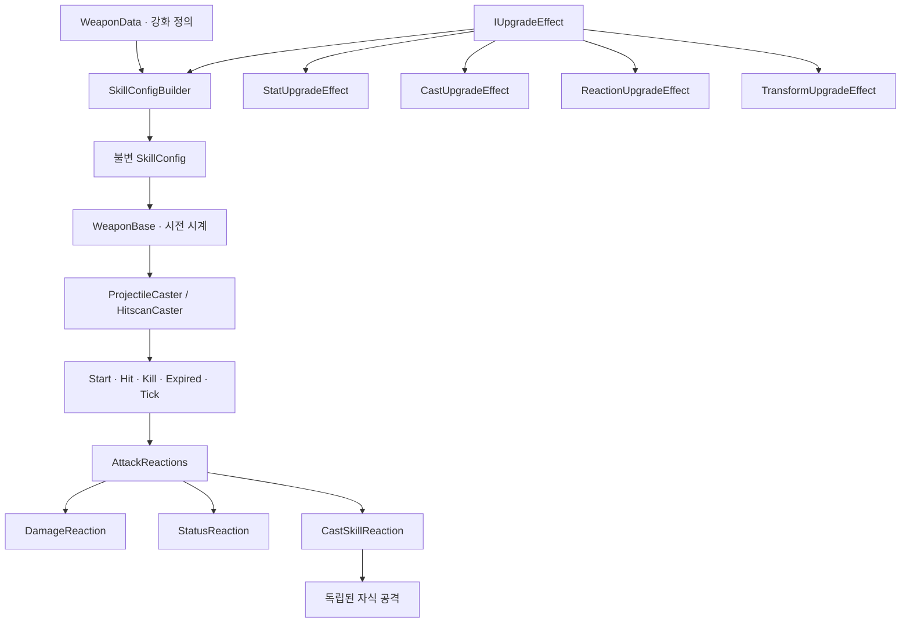

# 스킬 실행과 강화 조합 구조

2026-10-05. 사용자 제공 구조도와 [추가 인술 원문](ninjutsu-source-additional.txt)을 기준으로 기존 실행 코드를 재구성했다. 이 작업은 실행 중인 5종의 구조 변경이며, 나머지 10종의 전투 구현이나 밸런스 확정은 포함하지 않는다.

## 실행 흐름

`SkillConfig`는 공격 종류·경로·사거리, 효과별 스탯, 추가 이벤트 반응을 보존한다. `WeaponFactory`와 두 Caster는 미리 만든 설정을 받을 수 있다. 강화는 현재 설정의 복사본에 순서대로 적용하고 전부 성공하면 한 번에 교체한다. 공유 강화도 모든 참여 인술의 설정 준비가 성공한 뒤 함께 반영한다. 이미 발사한 공격의 수치와 콜백은 이후 강화에 따라 변하지 않는다.

기존 `IWeaponStats`, `BaseWeaponStats`, `StatDecorator`, 강화별 데코레이터는 제거했다. 실행 스탯은 `Cast`, `Projectile`, `Status`, `Burn`, `Explosion`, `Secondary`, `Field`의 불변 값으로 나뉜다. 타깃 선택, 전투 강화 횟수, 카드 후보 생성, 카탈로그 검증도 각각 독립된 책임으로 옮겼다.

## 강화 정의와 실행 효과

현재 `Weapons.json`의 `StatEffect { type, value }`는 데이터 호환을 위해 유지한다. `WeaponStatEffects.TryCompile`이 이를 `IUpgradeEffect`로 변환한다. 기존 ID, enum 숫자, 프리팹 GUID, 강화 순서와 조건은 유지한다. JSON DTO인 `StatEffect`와 실행 객체인 `StatUpgradeEffect`는 역할이 다르다.

| 실행 효과 | 책임 |
|---|---|
| `StatUpgradeEffect` | 공격력, 속도, 범위에 대응하는 기존 수치 계산 |
| `CastUpgradeEffect` | 발사 수·시전 수·예비 시전 수 변경 |
| `ReactionUpgradeEffect` | 특정 이벤트에 피해·상태·자식 시전 추가 |
| `TransformUpgradeEffect` | 현재 구현된 5개 형태로 전환 |

기존 상태이상·분열 등의 숫자 효과는 내부 어댑터 `NumericReactionUpgradeEffect`로 변환한다. 실제 투사체를 만들 때 해당 수치로 피해와 상태 반응을 컴파일한다. JSON에 임의 C# 타입이나 델리게이트를 직렬화하지 않는다. 새 이벤트 반응을 JSON에서 선언하는 범용 스키마는 이번 단계에 포함하지 않았다.

`CastSkillReaction`은 호출 횟수와 확률을 갖는다. 부모 반응 목록을 자식에 자동 복사하지 않는다. 삼각 얼음창 → 일반 얼음창 → 소형 얼음창은 각 단계의 Spawner가 전달할 수치와 다음 반응을 명시한다. 이를 통해 소형 투사체의 무한 분열과 형태 역변환을 막는다.

## 원문에서 요구하는 확장

| 인술 | 대표 강화 | 필요한 실행 요소 |
|---|---|---|
| 쿠나이 | 확산 쿠나이·추가 폭발·보조 피뢰침 | `Hit` → 독립 자식 공격, 자식 전용 강화 |
| 화염구 | 불꽃·번지는 화염 | 폭발 후 자식 공격, 상태이상 대상의 나중 사망 반응 |
| 얼음창 | 삼각 얼음창·스며드는 냉기 | 단계별 자식 설정, 상속할 효과의 명시 |
| 벼락 | 전자 분열·뇌전 제재 | `Hit`/`Kill` → 자식 공격 |
| 통나무 | 예비 통나무·화염 통나무 | 방벽 접근 트리거, 시전 효과와 형태 효과 조합 |
| 태양 광선 | 광선 발사·광선 난사·양전자포 | `Start` 자식 시전, Beam 공격, 다중 배치, 형태 전환 |
| 달빛 광선 | 월광 굴절·초점 조정·월광쿠나이 | Beam 경로, 같은 대상 공격 누적 상태, 다른 스킬 설정 참조 |
| 서리 감옥 | 얼음 결정 파열·매서운 서리 | `Expired` 자식 시전, 빙결 중 주기 피해 |
| 연쇄 번개 | 이온 폭파·전류전도 | Chain 공격의 `Bounce`, 경로 피해, 대상 상태 조건 |
| 운석 | 유성비·화염 운석 | 위치별 피해, 주기 자식 시전, 지속 지대 |
| 태풍 | 집중 폭풍·이중 태풍 | `Expired` 자식 시전, 동시 배치, 끌어당김 |
| 번개 그물 | 지속 감전·전율의 그물 | `Hit` → 연쇄 번개, 자식 반사 수 조정 |
| 모래 폭발 | 도약 모래 폭발 | 명중 후 이동·재공격, 도약 횟수 제한 |
| 나선 회오리 | 난기류·폭풍 집결·진공 | `Hit` → 다른 영역 스킬, 끌어당김과 밀침 정책 |
| 번개 구름 | 특이점·구름 분열·번개 유도 | `Expired` 자식 시전, `Hit` 확률 시전 |

`AttackEvent`에 `Tick`과 `Bounce`를 포함했다. 현재 투사체·Hitscan은 `Start`, `Hit`, `Kill`, `Expired`, `Tick`을 발생시키며, `Bounce`는 앞으로 Chain 공격이 발생시켜야 한다. `Tick`에는 공격별 경과 시간과 deltaTime을 전달한다. `PeriodicReaction`은 이 값으로 주기를 계산하므로 여러 공격이 같은 설정을 써도 타이머를 공유하지 않는다.

`Expired`는 투사체 수명이 끝날 때 발생한다. 관통 횟수를 소모해 회수되는 경우에는 발생하지 않는다. Hitscan의 `Expired`는 애니메이션/시간에 따른 Release 때 발생한다. 상태이상 대상의 지연 사망은 공격의 즉시 `Kill`과 다르므로 기존 점화 시스템의 사망 콜백을 유지한다.

## 구현 범위와 검증

일반 투사체, 삼각/소형 투사체, 보조 번개 구체, 벼락 시전 후 효과를 담당 코드로 분리했다. 투사체의 피해·상태 적용은 미리 만든 반응 목록을 순서대로 실행한다. 이동·충돌·관통 기록·풀링은 공격 오브젝트에 남긴다. 씬 전체 메시지 버스는 공격마다 발생하는 이벤트에 사용하지 않는다.

기존 숫자 강화 계산, (+) 변형, 공유 강화, 선행·배타 조건, HUD 발행, 상태이상 확률, 분열 단계, 풀 재사용 테스트를 유지했다. 추가 테스트는 스냅샷 불변성, 강화 배치 실패 시 반응까지 롤백, 반응 실행 순서, 종료 시 자식 생성, 주기 계산과 확률 시전을 검증한다.

Unity 6000.6.3f1 실제 EditMode 471/471 통과, 실패·건너뜀 0. 결과 XML·로그·소스 SHA-256 목록은 `out/skill-refactor/`에 보존한다. 상세 범위는 [Unity 검증](unity-validation.md)을 본다. 요구사항 검증기는 15종·168개 카드·66개 실행 연결 검사를 통과했다.

Beam·Chain·Area 공격의 본체, 캐릭터별 초기 습득/비기, 영구 레벨을 참조하는 동적 피해, 원문에 없는 수치, 새 반응 정의 JSON은 후속 구현 범위다. 현재 `TransformUpgradeEffect`는 구현된 형태 전환이며 공격 전략 자체를 런타임에 교체하는 기능은 아니다.
