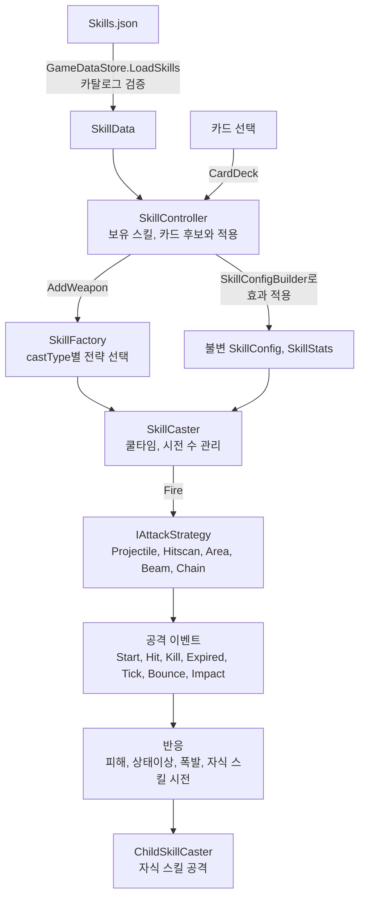

# 스킬 시스템

스킬이 어떻게 만들어지고 실행되는지, 새 스킬과 카드를 어떻게 추가하는지 정리한다. 코드가 원본이고, 이 문서는 코드를 읽기 전에 지도로 쓴다. 원문 요구사항, 확정·보류 결정, 카드별 대응표, 구현 이력은 [ninjutsu/README.md](ninjutsu/README.md)에 있다. 카드를 고르는 화면 흐름은 [flows.md](flows.md)의 "웨이브 게이지와 카드 선택"을 본다.

용어: **스킬**은 플레이어가 자동으로 시전하는 공격(화살, 벼락 등), **카드**는 웨이브가 끝날 때 3장 중 하나를 고르는 선택지다. 카드는 두 종류다.

| 종류 | 하는 일 | 데이터 위치 |
|---|---|---|
| 스킬 카드 | 새 스킬 획득, 스킬 강화 | `Skills.json`의 각 스킬(`upgrades`) |
| 일반 카드 | 스킬과 무관한 효과(방벽 수리 등) | `GeneralCards.json` |

## 1. 한눈에 보기



- **스킬 데이터는 JSON 하나**(`Resources/MockData/Skills.json`)이고 `GameDataStore`의 `Skills` 테이블이다. 호출마다 새 객체를 만들고 카탈로그 검증을 통과해야 쓸 수 있다.
- **설정은 불변**이다. 카드를 고르면 현재 `SkillConfig`의 복사본에 효과를 순서대로 적용하고, 전부 성공해야 한 번에 교체한다. 이미 발사한 공격은 이후 강화로 변하지 않는다.
- **새 카드는 데이터만, 새 스킬은 공격 구현 하나와 데이터만** 고치는 것이 목표 구조다.

## 2. 구성 요소

코드는 `Assets/_Project/Scripts/Runtime/Core/Skill/`에 있다.

| 요소 | 파일 | 책임 |
|---|---|---|
| 스킬 정의 | `SkillData`, `SkillBaseStats`, `SkillUpgradeOption`, `SkillUpgradeVariant`, `EffectDef` | JSON이 읽히는 형태 |
| 효과 종류 선언 | `EffectRegistry` | 효과 키, 분류, 쓰는 공격, 값 규칙, 적용 방식을 한 줄로 선언 |
| 설정과 스탯 | `SkillConfig`, `SkillStats`, `SkillStatEffects` | 불변 스탯 스냅샷, 효과를 설정에 컴파일해 적용 |
| 스킬 본체 | `SkillBase`, `SkillCaster`, `CastClock` | 쿨타임, 시전 수, 연발 간격, 강화 적용 |
| 시전 방식 | `SkillFactory`, `IAttackStrategy`, `*Strategy` | 공격 종류별 한 번의 시전 |
| 공격 실체 | `Projectile`, `HitscanEffect`, `AreaZone`, `ChainBolt` | 프리팹에 붙는 컴포넌트 |
| 이벤트와 반응 | `AttackReactions`, `ReactionCompiler`, `HitReactionBuilder` | 이벤트마다 피해, 상태, 자식 시전을 붙임 |
| 자식 스킬 | `ChildSkillEffects`, `ChildSkillCaster` | 다른 스킬의 이벤트 위치에서 스킬 시전 |
| 카드 | `SkillUpgradeChoices`, `UpgradeEligibility`, `SkillUpgradeTransaction`, `SkillUpgradeResolver` | 후보 만들기, 조건 판정, 적용, 영구 레벨 변형 |
| 카드 뽑기 | `Core/Card/CardDeck`, `GeneralCardRules` | 스킬 카드와 일반 카드를 합쳐 3장 뽑기, 일반 카드 조건·효과 |
| 총괄 | `SkillController` | 보유 스킬, 후보와 적용. 프리팹은 `SkillAssetTable`에서 `assetKey`로 찾음 |
| 에셋 표 | `SkillAssetTable` (`Assets/_Project/Data/SkillAssetTable.asset`) | 스킬별 프리팹, HUD 아이콘, 카드 아이콘을 `assetKey` 하나로 연결 |
| 검증 | `SkillCatalogValidator` | 시작할 때 카탈로그 오류를 카드 ID와 함께 거부 |
| 영구 성장 | `IWeaponProgression`, `ProfileWeaponProgression` | `progressionId`로 로비 영구 레벨 조회 |
| 시작 스킬 | `IStartingSkills`, `DefaultStartingSkills` | 전투 시작 때 가진 스킬(현재 벼락, id 3) |

## 3. 데이터 형식 (`Skills.json`)

### 스킬

| 필드 | 설명 |
|---|---|
| `id` | 스킬 ID. 새 스킬은 가장 큰 번호의 다음 번호를 쓴다 |
| `name`, `desc` | 이름과 설명 |
| `assetKey` | `SkillAssetTable`에서 프리팹과 아이콘을 찾는 키. 관례는 `weapon_이름`. **스킬마다 유일해야** 하고 비어 있으면 검증이 거부한다(4절) |
| `castType` | 공격 종류. **숫자**: 0 Projectile, 1 Hitscan, 2 Area, 3 Beam, 4 Chain |
| `element` | 속성. **숫자**: 0 Neutral(무), 1 Fire(화), 2 Ice(빙), 3 Wind(풍), 4 Lightning(뇌), 5 Earth(토). 생략하면 무속성이다. 적의 약점·저항이 이 값을 본다. 자식 스킬(`childOnly`)의 피해는 가장 바깥 스킬(부모)의 속성과 `castType`을 이어받는다 |
| `projectilePath` | 투사체 경로. **숫자**: 0 Aimed(가장 가까운 적), 1 RollingLane(대상 줄을 따라 굴러감), 2 Radial(발 수만큼 사방으로) |
| `baseStats` | 기본 수치. 필요한 묶음만 적는다(아래) |
| `upgrades` | 이 스킬의 카드 목록 |
| `maxLevel` | 최초 습득을 제외한 전투 중 강화 횟수 상한 |
| `childOnly` | true면 다른 스킬의 효과로만 시전되고, 새 스킬 카드로 제시하지 않는다 |
| `progressionId` | 로비 영구 성장 ID(`Upgrades` 테이블의 ID). 없으면 영구 레벨 0 |
| `prototypeBalanceSourceId` | 기본 수치 자료가 없을 때 참고한 다른 스킬 ID. 기록용이고 코드는 읽지 않는다 |

`baseStats` 묶음: `cast`(cooldown, baseDamage, range, projectileCount, castCount, castInterval), `projectile`, `reserve`, `status`, `explosion`, `field`, `area`, `beam`, `chain`. 적지 않은 묶음과 값은 클래스의 기본값(`castCount` 1, 확률 1 등)을 쓴다. 정의는 `SkillBaseStats`.

**사정거리(`cast.range`)**: 공격이 닿는 거리가 아니라 시전을 일으키는 조건이다. 시전 위치(플레이어)에서 이 거리 안에 살아 있는 적이 있어야 시전하고, 없으면 쿨타임을 쓰지 않고 기다린다. 굴러가는 공격(나무뿌리, `projectilePath: RollingLane`)은 플레이어에서 발사되지 않으므로 가로 위치(x)는 보지 않고 **벽 앞선에서 위로의 높이(y)** 가 이 거리 이내인 적을 노린다(벽에 가까운 순). 스킬 HUD 슬롯을 누르고 있는 동안 이 사정거리가 점선으로 보인다: 플레이어 기준 스킬은 플레이어를 중심으로 한 반원, 나무뿌리는 벽 앞선에서 사정거리만큼 위의 가로선이다(`SkillRangeResolver`, `SkillRangeIndicator`). 표시는 실제 판정 값 그대로다. 현재 값은 화면(월드 6.0 × 10.67) 안에 들어오도록 플레이어 기준 스킬 8, 나무뿌리 7이다. 나무뿌리가 벽 앞선에서 굴러가는 거리(`ProjectileLaunchPath.RollingTravelDistance`, 12)는 사정거리와 별개다.

### 카드 (`upgrades`의 항목)

```json
{
  "id": "arrow_multishot", "name": "화살 일제 사격", "desc": "발사 수 +1 / 공격력 -20%",
  "maxPickCount": 2,
  "effects": [ { "kind": "projectileCount", "value": 1 }, { "kind": "damage", "value": -20 } ],
  "variants": [ { "minPermanentLevel": 9, "name": "화살 일제 사격(+)", "desc": "발사 수 +1",
                 "effects": [ { "kind": "projectileCount", "value": 1 } ] } ]
}
```

| 필드 | 설명 |
|---|---|
| `id` | 카드 ID. 모든 스킬을 통틀어 유일해야 한다 |
| `maxPickCount` | 한 판에서 고를 수 있는 최대 횟수. 선택에 성공했을 때만 센다(제시만 되고 안 골랐거나 적용에 실패하면 세지 않는다) |
| `effects` | 효과 목록. 위에서부터 순서대로 적용하고, 하나라도 실패하면 카드 전체가 적용되지 않는다 |
| `variants` | `minPermanentLevel` 이상일 때 이름, 설명, 효과 **전체**를 교체한다. 카드 ID와 선택 횟수는 그대로다. 일반과 (+)는 같은 카드다 |
| `minBattleLevel` | 이 스킬의 전투 중 레벨이 이 값 이상일 때만 나온다 (기본 1) |
| `minPermanentLevel` | 로비 영구 레벨이 이 값 이상일 때만 나온다 |
| `requiredCardCounts` | `{skillId, cardId, count}`: 지정한 스킬의 카드를 count번 이상 골라야 한다. `skillId` 0은 자기 스킬. 같은 스킬의 카드를 한 번 먼저 고르라는 조건은 `{cardId, count: 1}`로 적는다 |
| `requiredWeaponIds` | 이 스킬들을 가지고 있어야 한다 |
| `exclusions` | `{skillId, cardId, belowPermanentLevel}`: 그 카드를 이미 골랐으면 나오지 않는다. `belowPermanentLevel`이 양수면 영구 레벨이 그 값 미만일 때만 적용 |
| `sharedId` | 두 스킬이 같은 선택 횟수를 공유하는 강화의 키. 같은 키를 가진 카드의 스킬이 함께 올라간다. 대상 스킬 목록은 데이터에 적지 않고 읽을 때 모은다(적어도 무시된다) |
| `enabled`, `disabledReason` | false면 후보에서 빼고, 샌드박스에는 사유를 보여 준다 |

조건은 한 방향으로만 건다. 서리 결정 연발→일제 사격→관통처럼 제외 조건을 양방향으로 바꾸면 선택 가능한 순서가 사라진다.

### 효과 (`effects`의 항목, `EffectDef`)

대부분의 효과는 `{ "kind": 키, "value": 숫자 }`만 쓴다. 키는 `EffectRegistry`에 등록된 것만 쓸 수 있고, 값의 단위는 키마다 다르다(`%`는 현재 값에 비율로 곱하고, `+`는 더하고, `=`는 값으로 정한다).

| 분류 | 키(값의 의미) | 쓰는 공격 |
|---|---|---|
| 시전 | `attackSpeed`(%, 쿨타임 감소), `damage`(%), `projectileCount`(+), `castCount`(+) | 전체 |
| 시전 | `reserveCasts`(=, 예비 시전 수) | Projectile |
| 시전 | `impactDamage`(%, 타격 지점 피해) | Projectile, Hitscan |
| 변형 | `form`(변형 이름, 아래) | Projectile, Hitscan |
| 투사체 | `pierceCount`(+), `projectileSpeed`(%), `projectileSize`(%), `knockback`(%) | Projectile |
| 폭발 | `enableExplosion`(=, 반경), `explosionDamage`(%), `explosionRadius`(%) | Projectile, Hitscan, Chain |
| 상태이상 | `freezeDuration`, `frostbite`, `stunDuration`, `slowDuration`, `vulnerabilityRatio`, `vulnerabilityDuration`, `stunChance` | Projectile, Area, Beam, Chain |
| 상태이상 | `paralysis`, `paralysisDuration` | 전체 |
| 점화 | `burnDuration`, `burnRatio`, `burnMaxHp`, `burnDeathExplosion` | Projectile |
| 번개 | `lightningStrike` | Projectile |
| 번개 | `killLightning` | Hitscan |
| 전자기장 | `fieldDuration`, `fieldDamageFlat`, `fieldDamageMultiplier` | Hitscan |
| 영역 | `areaRadius`, `areaDuration`, `areaMoveSpeed`, `areaPull`(모두 %) | Area |
| 광선 | `beamLength`, `beamWidth`, `beamDuration`, `beamPulses`(%), `beamPulsesFlat`(+) | Beam |
| 연쇄 | `chainBounces`(+), `chainJumpRange`(%), `chainPath`(=, 경로 폭) | Chain |
| 자식 시전 | `onEvent`, `periodic`, `inherit` | 전체 (6절) |

정확한 단위와 허용 값은 `EffectRegistry.cs`의 선언이 기준이다. 스킬의 공격 종류가 소비하지 않는 효과를 카드에 적으면 조용히 무시되므로 검증이 카드 ID와 함께 거부한다.

**변형(`form`)**: 변형 이름을 적는다. `{ "kind": "form", "form": "TriangleIce" }`. 쓸 수 있는 이름은 `Enbakutsu`, `JudgementThunder`, `TriangleIce`, `LargeLog`, `FireLog`다(대소문자 무시). 없는 이름과 `Default`는 검증이 거부한다.

## 4. 공격 종류

| `castType` | 전략 | 프리팹에 필요한 컴포넌트 | 동작 |
|---|---|---|---|
| 0 Projectile | `ProjectileStrategy` | `Projectile` | 날아가 맞춘다. 경로(`projectilePath`), 관통, 폭발, 점화 |
| 1 Hitscan | `HitscanStrategy` | `HitscanEffect` | 대상 위치에 즉시 타격. 벼락, 전자기장 |
| 2 Area | `AreaStrategy` | `AreaZone` | 위치에 머무는 범위. 이동, 끌어당김, 펄스 피해 (냉기 지대, 전기 구름) |
| 3 Beam | `BeamStrategy` | `AreaZone` | 지속하며 닿는 모든 적을 공격하는 선 (에너지 빔) |
| 4 Chain | `ChainStrategy` | `ChainBolt` | 여러 적을 연쇄로 튕기며 공격 (연쇄 번개) |

**에셋 표 규칙**: 스킬의 프리팹, HUD 아이콘, 카드 아이콘은 `SkillAssetTable`의 항목 하나(`key` = 스킬의 `assetKey`)에 모은다. 항목은 `prefab`, `hudIcon`, `newCardIcon`(새 스킬 카드), `upgradeCardIcon`(강화 카드)을 가진다. 카드마다가 아니라 스킬마다 아이콘 두 장이다. 자식 전용 스킬은 `prefab`만 있으면 된다. 표에는 기본 아이콘(`hudFallback`, `cardFallback`)이 있어 아이콘이 비어 있으면 기본 아이콘이 나온다. 스킬이 아닌 일반 카드는 `IconKey`를 같은 표의 `key`로 쓰고 `upgradeCardIcon`을 쓴다. 형태 변환 아이콘은 스킬 항목이 아니라 표의 `formIcons`(형태 → 아이콘)에 둔다. 비어 있으면 변환 카드를 가진 스킬의 `hudIcon`이 나온다.

## 5. 카드 뽑기와 적용

1. 웨이브 게이지가 차면(마지막 웨이브 제외) `StageManager`가 `CardDeck.Draw(3)`을 부른다. 후보가 하나도 없으면 카드 선택 화면으로 넘어가지 않는다.
2. **스킬 카드 후보**: 보유한 스킬(만렙 제외)의 카드 중 `UpgradeEligibility`를 통과하고 변형이 풀리는 것, 그리고 아직 없는 스킬의 새 스킬 카드(프리팹이 연결되고 `childOnly`가 아닌 것). `sharedId` 카드는 한 번만 후보가 된다.
3. **일반 카드 후보**: `GeneralCards.json`에서 조건(`Condition`)이 맞고 `MaxPicks`를 넘지 않은 것. `Forced`이면 3장 중 한 칸을 먼저 차지한다(한 번에 최대 1장, 여럿이면 `Priority`가 높은 쪽, 같으면 무작위). `Forced`가 아니면 스킬 카드와 같은 후보 목록에서 무작위로 섞인다.
4. 고르면 `CardDeck.TryApply`가 스킬 카드는 `SkillController`로 넘긴다. 강화는 효과를 순서대로 적용한 설정을 만들고, 전부 성공해야 교체한다(공유 강화는 참여한 모든 스킬이 준비되어야 함께 반영). 일반 카드는 조건이 아직 맞는지 한 번 더 확인하고 효과를 적용한다.
5. 일시정지 뒤 카드 선택으로 돌아올 때는 후보를 다시 뽑지 않는다(리롤 방지).

### 카드 아래 형태 변환 표시

카드 선택 화면에서 카드마다 아래에 형태 변환(효과에 `form`이 있는 카드) 아이콘이 최대 3개 붙는다. 후보를 만들 때 `FormHintFinder`가 카드마다 관계를 찾아 `UpgradeChoice.FormHints`에 넣고, `CardSlotView`가 그린다.

| 표시 | 언제 |
|---|---|
| 아이콘만 (`Enables`) | 이 카드가 변환의 조건이다. 새 스킬 카드는 그 스킬의 변환과 그 스킬을 `requiredWeaponIds`로 요구하는 변환에 붙는다. 강화 카드는 아직 안 가진 `requiredCardCounts`일 때만 붙는다 |
| 아이콘 + X (`Blocks`) | 이 카드를 고르면 변환을 더는 얻을 수 없다. 변환 카드의 `exclusions`에 이 카드가 있고 지금 영구 레벨에서 그 배타가 살아 있을 때 |
| 안 보임 | 이미 얻은 변환, 이미 막힌 변환(배타 카드 보유), 꺼진 변환, 영구 레벨이 모자라 이번 판에 못 얻는 변환. 일반 카드와 변환 카드 자신에도 붙지 않는다 |

전투 레벨, 필수 카드, 필수 스킬은 판 안에서 채울 수 있어서 "안 보임" 판정에 쓰지 않는다. 배타 판정은 `UpgradeEligibility`와 같은 함수(`ExclusionOwner`, `ExclusionApplies`)를 써서 표시와 실제 획득이 어긋나지 않는다. 예: 통나무를 가진 상태에서 `log_large` 카드가 나오면 아래에 불타는 뿌리 아이콘이 X와 함께 붙는다.

**일반 카드**(`GeneralCards.json`)의 한 행:

```json
{ "Id": "wall_repair", "Name": "방벽 수리", "Desc": "방벽 체력 +20", "IconKey": "wall_repair",
  "MaxPicks": 999, "Forced": true, "Priority": 0,
  "Condition": { "Kind": "wallHpBelow", "Value": 50 },
  "Effect":    { "Kind": "wallRepair",  "Value": 20 } }
```

조건과 효과의 종류는 `GeneralCardRules`에 이름으로 등록한다. 지금은 조건 `wallHpBelow`(방벽 체력이 값% 이하)와 효과 `wallRepair`(방벽 체력 +값)뿐이다. 새 종류는 그 파일에 한 줄 더하고 JSON에서 그 이름을 쓰면 된다. 모든 스킬에 걸치는 효과(전체 공격력 +10% 등)는 스킬 쪽에 "전체 보너스"를 저장하는 곳이 없어 줄 하나로 안 되고, 먼저 `SkillController`에 만들어야 한다.

## 6. 이벤트, 반응, 자식 스킬

**공격 이벤트**: `Start`(시전 시작), `Hit`(적중한 적마다), `Kill`(처치), `Expired`(수명 종료), `Tick`(매 프레임), `Bounce`(연쇄가 새 대상에 도착), `Impact`(범위형이 목표 지점에 한 번 닿음).

**자식 스킬**: 다른 스킬의 이벤트 위치에서 시전되는 스킬이다. 자식도 평범한 스킬이고 `childOnly: true`만 다르다.

```json
{ "kind": "onEvent", "trigger": "Hit", "skillId": 13, "count": 2, "excludeHit": true,
  "inherit": { "damage": 0.5, "projectileSpeed": 1 } }
```

| 필드 | 설명 |
|---|---|
| `kind` | `onEvent`(이벤트 때 시전), `periodic`(주기 시전, `interval` 초), `inherit`(자식의 상속 규칙만 추가) |
| `trigger` | 시전 시점(`AttackEvent` 이름) |
| `skillId` | 자식 스킬 ID |
| `chance` | 시전 확률(0 초과 1 이하, 기본 1) |
| `count` | 한 번의 시전에서 쏘는 수. 가까운 적부터 서로 다른 적에게 나뉜다 |
| `damageScale` | 자식 피해 배율 |
| `inherit` | 부모 스탯 × 배율을 자식의 값으로 가져온다. 키는 스탯 이름 |
| `excludeHit` | 방금 맞은 적은 조준하지 않는다. 다른 적이 없으면 부모가 날아온 방향 기준 -30~+30도 부채꼴로 쏜다 |
| `onlyForm` | 이 변형일 때만 이 반응이 붙는다 |
| `target` | 0이 아니면 부모가 아니라 그 ID의 스킬에 효과를 붙인다(자식 전용 강화, 손자 시전 붙이기) |

자식 설정의 계산 순서는 자식 기본 설정 → 상속 → 발사 수(`count`) → 피해 배율 → 보관 효과(카드를 얻은 순서)다. 자동 재분열과 무한 전파는 허용하지 않고, 시전이 순환하면 검증이 막는다. 설계 배경은 [ninjutsu/README.md](ninjutsu/README.md)의 6.6.

## 7. 스킬 추가 절차

### A. 기존 공격 종류로 새 스킬 만들기

1. **정의**: `Skills.json`에 스킬을 추가한다. `id`, `name`, `assetKey`(다른 스킬과 겹치지 않게), `castType`, `baseStats`(필요한 묶음), `maxLevel`, `upgrades`(처음에는 비어 있어도 된다). 다른 스킬의 효과로만 쓰면 `childOnly: true`.
2. **프리팹**: `Prefabs/Skills/`에 공격 실체 프리팹을 만든다. 4절 표의 컴포넌트가 붙어 있어야 한다. 같은 컴포넌트를 쓰는 기존 프리팹을 복제해 시작하면 쉽다.
3. **에셋 표 항목**: `Assets/_Project/Data/SkillAssetTable`을 열어 항목을 하나 추가한다. `key`는 `Skills.json`의 `assetKey`와 같게 하고 `prefab`에 2번 프리팹을 넣는다. 프리팹이 없으면 새 스킬 카드로 나오지 않는다. 플레이어 프리팹은 건드리지 않는다.
4. **아이콘**: 같은 항목에 `hudIcon`, `newCardIcon`, `upgradeCardIcon`을 넣는다. 아트가 아직 없으면 기존 아이콘을 임시로 연결한다. 자식 전용 스킬은 아이콘이 필요 없다.
5. **눈으로 확인**: **Tools → Project Nova → Skill Sandbox**를 열면 스킬이 목록에 자동으로 나온다. 카드를 고르고 적을 놓아 동작과 수치를 본다(8절).
6. **영구 성장**을 쓰면 `progressionId`를 `Upgrades` 테이블의 ID와 맞춘다.
7. **검증**: 실제 공격 동작 테스트를 돌린다(9절). 프리팹 컴포넌트와 아이콘 연결은 샌드박스와 카드 화면에서 직접 확인한다.

### B. 새 카드 만들기 (기존 효과만 쓰는 경우)

1. 스킬의 `upgrades`에 카드를 적는다(3절). `id`는 전체에서 유일해야 한다.
2. 선행·제외·영구 레벨 조건이 필요하면 해당 필드를 적고, 일반/(+)가 다르면 `variants`를 쓴다.
3. 카드 아이콘은 스킬 단위라 따로 필요 없다.
4. 샌드박스에서 확인하고, 카드 효과와 실제 공격 동작 테스트를 실행한다(9절).

### C. 새 효과 종류 만들기

1. `EffectRegistry`에 한 줄을 더한다(키, 분류, 쓰는 공격, 값 규칙, 적용).
2. 새 스탯이 필요하면 `Stat` enum, `SkillStats`의 기본값, 묶음의 속성에 한 줄씩 더한다.
3. 스탯을 읽는 쪽에서 쓴다. 반응이면 `ReactionCompiler`/`HitReactionBuilder`, 그 밖이면 해당 전략이다.
4. 효과를 소비할 수 없는 공격은 검증기가 거부하는지 확인하고, 새 효과가 실제 적중·상태이상·자식 시전에 반영되는 동작 테스트를 실행한다.

### D. 자식 스킬 시전 카드 만들기

1. 자식이 될 스킬을 `childOnly: true`로 추가하고 A와 같이 프리팹과 연결, 아이콘을 만든다.
2. 부모 카드에 `onEvent`/`periodic` 효과를 적는다(6절). 자식 전용 강화는 `target`을 쓴다.
3. 자식이 부모의 수치를 쓰게 하려면 `inherit`를 적는다.

### E. 새 공격 종류 만들기

1. `CastType`에 값을 더하고 `IAttackStrategy` 구현(`Fire`, `Tick`)을 만든다. 풀링과 자원 정리는 전략이 갖는다.
2. `SkillFactory`의 등록 표에 한 줄을 더한다. 등록하지 않으면 카탈로그 검증이 시작 때 막는다.
3. 공격 실체 컴포넌트를 만들고, `EffectRegistry`에서 새 종류가 쓰는 효과의 허용 공격을 반영한다.
4. 프리팹 컴포넌트 검증(`SkillCatalogSafetyNetTests`)에 새 종류를 추가한다.

### F. 새 변형(form) 만들기

`SkillForm` enum에 값을 더하고, `EffectRegistry`의 `form` 허용 값에 넣고, 그 변형의 겉모습을 처리하는 코드(스프라이트 교체는 `ProjectileVisual.FormSprite`)를 추가한다. 데이터에는 이름으로 적는다. 카드 선택 화면의 변환 아이콘은 `SkillAssetTable`의 `formIcons`에 연결한다(5절). 변형이 늘 때마다 코드를 고쳐야 하는 한계는 10절.

### G. 일반 카드 만들기

기존 조건과 효과를 쓰면 `GeneralCards.json`에 행만 추가한다. 새 조건이나 효과 종류가 필요하면 `GeneralCardRules`에 한 줄 더한다(5절). 아이콘은 `IconKey`와 같은 `key`의 `SkillAssetTable` 항목(`upgradeCardIcon`)에 연결하며, 없으면 기본 카드 아이콘이 나온다.

## 8. 스킬 샌드박스

**Tools → Project Nova → Skill Sandbox**: 스킬과 카드를 코드 수정 없이 눈으로 확인하는 독립 씬이다(`Scenes/Sandbox/SkillSandbox.unity`, 코드는 `Game.Sandbox` 어셈블리로 에디터와 개발 빌드에서만 컴파일). 스테이지와 같은 카메라, 플레이어, 벽 위치에 실제 `Enemy` 프리팹을 놓는다.

- 스킬은 `Skills.json`에서 자동으로 나오고(프리팹이 연결되지 않은 스킬은 비활성), 버튼으로 켜고 끈다. 최대 5개를 함께 켜며, 쿨타임은 인게임과 같은 `SkillHud` 프리팹(오른쪽 위)이 보여 준다.
- 카드는 켠 스킬마다 목록에서 직접 고른다. 선행·배타 조건은 게임과 같은 판정(`UpgradeEligibility`)이고, 카드마다 조건과 충족 여부를 보여 주며 못 고르는 카드는 비활성이다. 영구 레벨 조건(`minPermanentLevel`)은 충족 여부만 표시하고 막지 않는다. **선행·배타 조건 무시**를 켜면 조건만 건너뛴다. 공유 카드(증폭·연마)는 두 스킬을 함께 켜면 고를 수 있다. 구성이 바뀔 때마다 처음부터 다시 쌓아 카드 순서까지 재현한다. 일반 카드는 나오지 않는다.
- 적은 고정 샌드백(1, 3, 5, 10마리)과 벽을 향해 내려오는 모드가 있고, 누적 피해와 초당 피해(DPS)가 보인다.
- 영구 레벨, 시간 배속, 구성 저장·불러오기 3칸이 있다.

자세한 사용법은 [ninjutsu/README.md](ninjutsu/README.md)의 6.7.

## 9. 검증

Unity CLI로 EditMode 테스트를 돌린다.

```sh
unity command run_tests editor --result-only --timeout 180
python3 docs/ninjutsu/validate_requirements.py
```

| 지키는 것 | 테스트 |
|---|---|
| 카탈로그 검증, 공격 종류와 효과의 불일치 거부 | `SkillCatalogSafetyNetTests`, `SkillExecutionTests` |
| 카드 적용·거절·중복 방지와 실제 공격 | `SkillExecutionTests`, 공격 종류별 테스트 |
| 자식 시전, 조건부 반응, 순환 거절 | `ChildStatReferenceTests`, `SkillChildEffectTests` |
| 공격 종류별 동작 | `AreaSkillTests`, `BeamSkillTests`, `ChainSkillTests` 등 (`CatalogWorld`로 실제 카탈로그와 프리팹을 씀) |
| 카드 뽑기, 일반 카드 | `UpgradeEligibilityTests`, `CardDeckTests` |

**밸런스 변경**: 카드 적용과 실제 프리팹을 사용하는 전투 테스트를 실행하고 Skill Sandbox에서 동작을 확인한다. 계산 결과·필드 복사·에셋 연결 대조와 카드 수치를 복제한 골든 파일은 사용하지 않는다. 테스트 유지 기준과 전체 실행 방법은 [testing.md](testing.md)를 본다.

**요구사항 검증기**(`validate_requirements.py`)는 원문 15종·168개 카드와 실행 데이터의 연결(ID, 참조, 횟수, 선행 그래프)을 확인한다. 카드 ID나 스킬을 바꾸면 `requirements.json`도 같이 고친다.

## 10. 알려진 한계와 주의

- `castType`과 `projectilePath`는 JSON에 **숫자**로 적는다(위 표 참고). enum 중간에 값을 끼우면 데이터의 숫자가 밀려 엉뚱한 종류가 되므로, 값은 항상 끝에 더한다. `form`처럼 이름으로 바꾸는 것이 개선 후보다.
- 변형(`form`)은 스킬 전용 이름이 든 enum이라 새 변형마다 코드를 고쳐야 한다. 문자열 키와 프리팹의 `키 → 스프라이트` 표로 바꾸는 것이 개선 후보다.
- 전자기장(벼락의 부가 효과)은 아직 코드로 남아 있다. 영역 스킬로 옮기려면 영역의 감속, 고정 피해 분리, 펄스 간격 맞춤이 먼저 필요하다.
- 새 스킬의 아이콘과 프리팹 일부(냉기 지대, 전기 구름, 에너지 빔, 연쇄 번개)는 임시 연결이다.
- 카드 ID, `progressionId`, enum 숫자를 바꾸면 `Skills.json`, 테스트, `requirements.json`, `validate_requirements.py`, `LocalUpgradeApi`를 함께 고쳐야 한다. `assetKey`를 바꾸면 `SkillAssetTable`의 `key`도 같이 고친다(에셋이라 테스트가 불일치를 알려 준다).
- 한 PR에 enum 재배열, JSON 변환, 테스트 수정이 겹치면 리뷰가 어렵다. 커밋을 나눈다.
